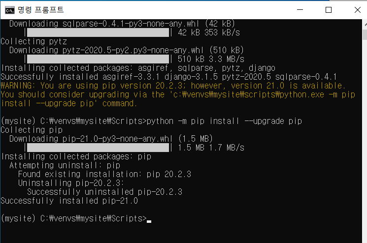
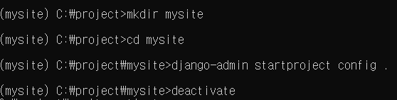
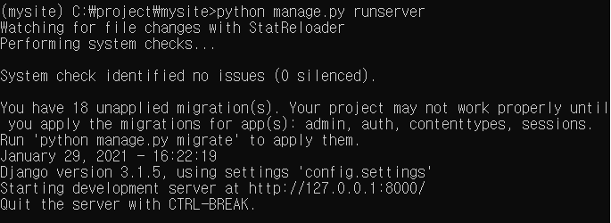
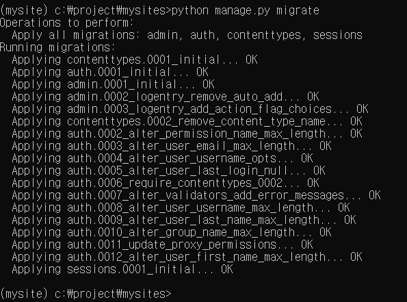
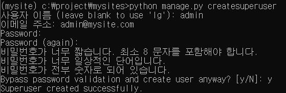
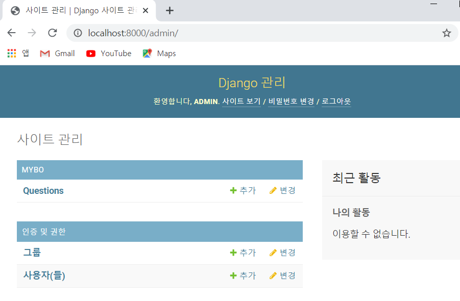
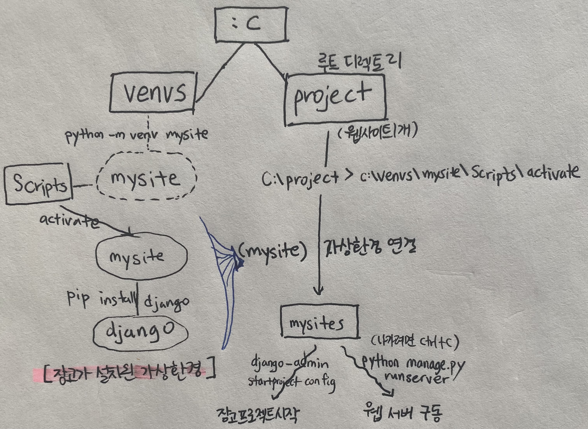
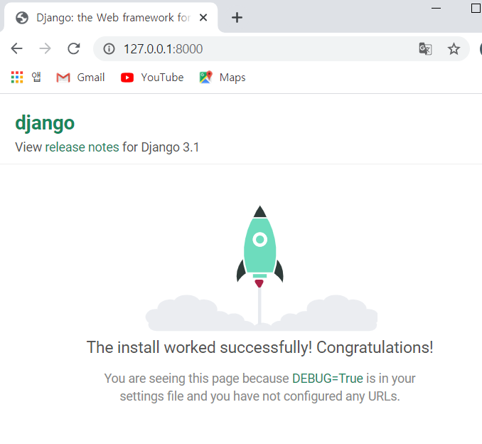
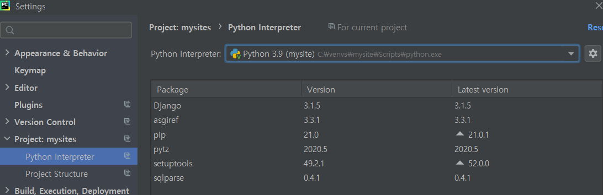

# 환경설정

- 명령프롬프트에서 python치면 바로 연결되게 고급설정

- C드라이브에 가상환경 폴더 venvs 만들기

  

## 장고가 설치된 가상환경

- 파이썬 가상환경 만들기(venv모듈 사용해서 mysite이름의 가상환경 생성)

  `python -m venv mysite`  ( => mysite 폴더도 만들어짐)

- mysite->Scripts->들어가서 `activate`하여 가상환경 들어가기

  +activate 명령어는 Scripts 안에 있음

  +Scripts 안에 장고도 있고 파이썬도 있음


- 장고 깔기 `pip install django==3.1.3`

- 업그레이드 하라고 뜨면 `python -m pip install --upgrade pip`

  *명령어 잘 보고 적당히 변형해서 적용하기*



- 끌 때는 `exit`

### 루트 디렉토리

- c\에서 새로운 폴더 **project** 만들기

- C:\project>`C:\venvs\mysite\Scripts\activate`입력해 가상환경 연결

  ```
  가상환경 : 프로젝트를 독립적으로 수행하기 위해 사용
  (서로 다른 버전에서 개발 가능)
  ```

- 또 mysites폴더 만들고 그 안에 <strong>장고 프로젝트</strong> 시작

  `django-admin startproject config .`
  
  

- 가상환경 나가려면 `deactivate`

- 웹서버 구동

   `python manage.py runserver`



​		※헷갈려서 mysite->mysites로 바꿈

- 초기 마이그레이션(데이터베이스 및 User, Group 테이블 생성)

  `python manage.py migrate`

  

### admin

관리자 계정 생성 :`python manage.py createsuperuser`



- admin.py에 Question게시판 추가

  ```python
  from django.contrib import admin
  from .models import Question
  
  admin.site.register(Question)
  
  #질문 검색창 추가
  class QuestionAdmin(admin.ModelAdmin):
      search_fields=['subject'] 
  ```

  http://localhost:8000/admin 에 로그인하면 게시판 확인가능

  

### 내가 그린 요약도




잘 됐는지 브라우저에 http://127.0.0.1:8000 나 http://localhost:8000로 확인




※**부록** : 매번 가상환경 연결 주소 치기 귀찮으니 명령창에 `mysite`만 줘도 (mysite)가상환경 연결되게 설정하기

```
메모장에
"@echo off
cd c:/project/mysites
c:/venvs/mysite/scripts/activate"
다른이름으로 저장->venvs에 저장(시스템파일로 자동 변경됨)
내PC->고급설정->환경변수->Path에 'C:\venvs' 경로 추가

이제 명령창에 mysite만 쳐도 어디에 있든 project\mysites 가상환경으로 연결됨
```


## 파이참 연결

: 파이참에 파이썬도 가상환경에 있는 파이썬으로 연결해주어야한다

- existing environment에서 경로-> venvs\mysite\Scripts\python.exe



- settings.py에서 

```
LANGUAGE_CODE = 'ko-kr'

TIME_ZONE = 'Asia/Seoul'
```

​	로 변경해주면 웹사이트 한국어로 나온다.


## DB Browser for SQLite

: 데이터베이스 관리 도구. sqlitebrowser.org/dl에서 다운로드

- 데이터베이스 열기 ---> project\mysites\db.sqlite3


<i>※ sql 몰라도 장고 ORM(Object Relational Mapping)이 파이썬으로 데이터 작업 할 수 있음</i>


