# 프로젝트 mysites

: mysites는 내가 만드려는 웹사이트 이름인 셈.


# mybo

- mybo라는 게시판 앱 설치

  `django-admin startapp mybo`

- 게시판 주소는 http://127.0.0.1:8000/mybo 가 된다.

- 동작 과정

```
1) http://127.0.0.1:8000/mybo 페이지 요청
2) 장고가 url 매핑 확인(config/urls.py에서)
3) 등록되어 있으면 해당 페이지 제공, 안됐으면 404 오류
```

### url 매핑

```python
1) 주소로 가보면 404오류가 남.
2) config/urls.py에서 매핑

from django.contrib import admin
from django.urls import path
from mybo import views

urlpatterns = [  #앞에 호스트 주소는 생략가능
    path('admin/', admin.site.urls),
    path('mybo/', views.index), #views파일의 index로 직접 매핑  
	path('mybo/', include('mybo.urls')), #mybo로 시작되는 호출은 모두 mybo/urls.py의 매핑 규칙을 참조

]
```

```python
mybo/urls.py에 따로 매핑 규칙 적기

from django.urls import path
from . import views #.은 현재 디렉토리

urlpatterns=[
    path('',views.index), #mybo 써줄 필요 없어서 ''

]
```

- 실행했을 때 에러 : `AttributeError: module 'mybo.views' has no attribute 'index'`

```python
3) mybo/views.py에서 화면에 보일 부분 작성

from django.http import HttpResponse

def index(request):
    return HttpResponse("제가 만든 홈페이지입니다.")
```


장고는 모델로 데이터 관리

데이터 저장, 조회 삭제는 sql 쿼리문 사용

migrate 명령: admin, auth, sessions 등의 앱이 필요로 하는 테이블을 생성

테이블=데이터를 저장하는 집합

데이터베이스=테이블 ...의 모음


## QnA

:질문하고 답하는 게시판 만들기


- 장고는 모델을 이용하여 테이블을 생성한다

```python
mybo/models.py

from django.db import models

# Create your models here.
class Question(models.Model):
    subject=models.CharField(max_length=200) #제목속성.글자수제한
    content=models.TextField() #게시글 본문
    create_date=models.DateTimeField() #게시일

class Answer(models.Model):
    question=models.ForeignKey(Question, on_delete=models.CASCADE) #모델간의 연결
    #답변과 연결된 질문이 삭제되면 답변도 삭제된다
    content=models.TextField() #답변글 본문
    create_date=models.DateTimeField() #게시일

```

​	※ model field references : 

[Model field reference | Django documentation | Django (djangoproject.com)](https://docs.djangoproject.com/en/3.0/ref/models/fields/#field-types)


- 설치된 앱에 추가하여 인식시키기(apps.py에 있는 class명 추가해주기)

```python
mybo/settings.py 안의 INSTALLED_APPS에
'mybo.apps.MyboConfig' 추가
```

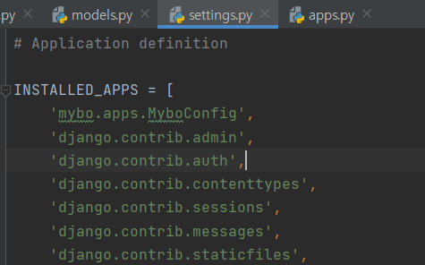


- 새롭게 테이블을 생성/수정하는 경우에는 먼저 테이블 작업에 필요한 파일을 만든다.

  테이블 생성 명령 : `python manage.py makemigrations`

  `mybo\migrations\0001_initial.py` 파일과 모델들 만들어짐

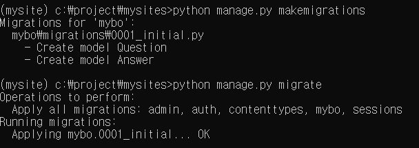

- 만든 모델들이 데이터베이스에 잘 들어가 있다.

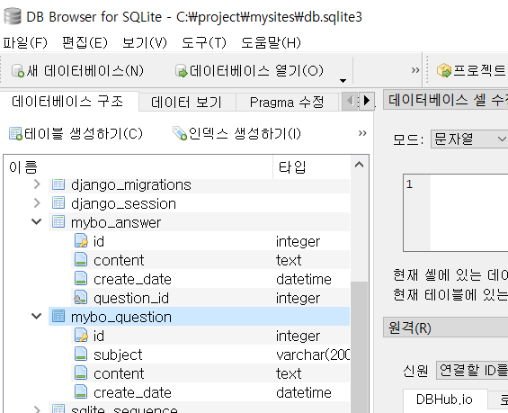

### shell

: 코드로 직접 작성할 때

`python manage.py shell`

- 모델 불러와서 작성

  `from mybo.models import Question, Answer`

- 테이블 내용을 작성하고 저장하면 자동으로 번호가 붙는다.

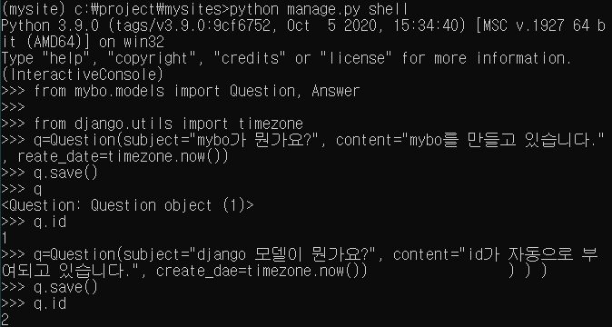

​	` Question.objects.all()` : Question모델 객체 전체 id 출력

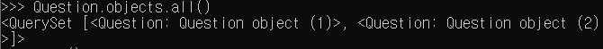

- 내용 변경 (method 추가 등)

  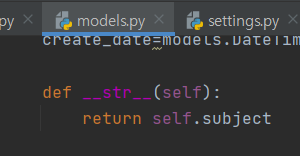

  `quit` 후 재시작해야 새로고침 된다. 

  ` Question.objects.all()` : Question모델 객체 전체 subject 출력

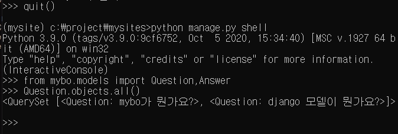

#### .objects.+

- `filter` : 

  - <QuerySet 리스트형태 >로 나열. 

  - 여러 건의 데이터를 리턴할때 쓴다. 

  - 없으면 빈 리스트를 리턴한다.

    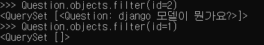

- `get` : 

  - 한 건의 데이터를 리턴할 때 쓴다. 
  - 없으면 에러

- 데이터 수정(save 해줘야함)

  재정의하면 됨. 검색할때 (속성명__contains='찾는단어')

  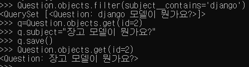

- 데이터 삭제

  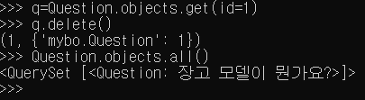


**질문 모델에 연결된 답변 모델 작성하기**

- 질문에 연결된 답변 찾을 때 답변이 여러 개일 수 있기 때문에 `_set.all()`함수 쓴다.

  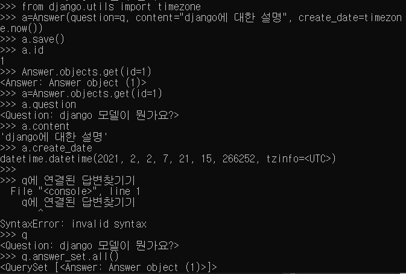

힘들어서 정리는 여기까지..


## 질문 출력

- 질문 리스트(index)와 상세페이지(detail) 출력

```python
mybo/views.py에서

from .models import Question

# Create your views here.
def index(request):
    question_list=Question.objects.order_by('-create_date') #-는 내림차순
    context={'question_list':question_list}
    return render(request, 'mybo/question_list.html',context)


def detail(request, question_id):
    question=Question.objects.get(id=question_id)
    context={'question':question}
    return render(request, 'mybo/question_detail.html', context)
```

```
#render는 context에 있는 질문데이터를 
템플릿 (mybo/question_list.html)형식으로 적용하여 
html코드로 변환하여 출력
#템플릿 저장하는 디렉토리 생성할것
```


- 템플릿 만들어 넣기

```python
templates 디렉토리 따로 만들어서 mybo 디렉토리 안에 저장
'mybo/question_list.html'
'mybo/question_detail.html'

config/settings.py에서 템플릿에 #BASE_DIR/'templates'추가
=템플릿들은 템플릿 폴더에 저장한다

TEMPLATES=[{'DIRS':[BASE_DIR/'templates'],}] 
```

### 템플릿 태그

:html 문서 내부에 동적 코드 삽입용

-  와 {{ python 코드(화면에 출력) }}는 태그 분리해서 사용

```html
 <!--question_list에 데이터가 있다면-->
    <ul>
    
        <li><a href="/mybo/{{ question.id }}/">{{ question.subject }}</a></li>
    
    </ul>

    <p>질문이 없습니다.</p>


<!--li태그 대신 반복문으로-->

	<p>순서:{{forloop.counter0}}</p> <!--for문 0부터 표시-->
	<p>순서:{{forloop.counter}}</p> <!--for문 1부터 표시-->
	<p>{{item}}</p>

```


### a태그 url 설정

```
a태그를 만들었으니 urls.py에서 url매핑하여 url을 연결해주어야 한다.
파이썬 코드 대신 별칭을 이용한 html코드로 작성하여 대규모 데이터 동시 변경에 적합하게 한다. 
```

※ url 별칭 설정 : name='' 속성 추가, 네임 스페이스 추가

```python
mybo/urls.py 에서 name='index' 속성 추가

from django.urls import path
from . import views #.은 현재 디렉토리

app_name='mybo' #네임스페이스(서로 다른 앱에서 동일한 이름의 객체를 구분하기 위해

urlpatterns=[
    path('',views.index, name='index'),
    path('<int:question_id>/',views.detail, name='detail'),
]
```

```python
question_list.html 수정

변경 전
<a href="/mybo/{{ question.id }}/">{{ question.subject }}</a>

변경 후
<a href="">{{ question.subject }}</a>
```


### 스타일 추가

:css 같은 정적파일들은 static 폴더에 저장한다. `mkdir static`

```python
settings.py 맨 마지막에 추가

STATICFILES_DIRS = [
    BASE_DIR / 'static',
]
```

- html에 적용할 때 헤드 안에

```html

<link rel="stylesheet" type="text/css" href="">
```

- 질문 페이지 스타일 설정 후

```html


<link rel="stylesheet" type="text/css" href="">


<div class="container my-3">
    <table class="table">
        <thead>
        <tr class="thead-dark">
            <th>번호</th>
            <th>제목</th>
            <th>작성일시</th>
        </tr>
        </thead>
        <tbody>
        
        
        <tr>
            <td>{{ forloop.counter }}</td>
            <td>
                <a href="">{{ question.subject }}</a>
            </td>
            <td>{{ question.create_date }}</td>
        </tr>
        
        
        <tr>
            <td colspan="3">질문이 없습니다.</td>
        </tr>
        
        </tbody>
    </table>
</div>
```

※ 스타일 무료 공유 - getbootstrap.com/docs/4.5/getting-started/download


### 오류페이지 표시

- get_object_or_404 : 객체를 가져오는데 아니면 404 오류 나도록

```python
mybo/views.py에 추가

from .models import Question
from django.shortcuts import get_object_or_404, render

def detail(request, question_id):
    # question=Question.objects.get(id=question_id)
    question=get_object_or_404(Question, pk=question_id)
    context={'question':question}
    return render(request, 'mybo/question_detail.html', context)

```


## 질문 상세 및 답변 출력

```html
mybo/question_detail.html


<link rel="stylesheet" type="text/css" href="">

<h1>{{question.subject}}</h1>
<div>
    {{question.content}}
</div>

<form action="" method="post">
 <!--암호화-->
<textarea name="content" id="content" rows="15"></textarea>
<input type="submit" value="답변등록">
</form>
```

```python
mybo/urls.py

from django.urls import path
from . import views #.은 현재 디렉토리

app_name='mybo' 

urlpatterns=[
    path('',views.index, name='index'),
    path('<int:question_id>/',views.detail, name='detail'),
  path('<int:question_id>/',views.answer_create,name='answer_create'),
]
```

```python
mybo/views.py

from django.shortcuts import render,get_object_or_404,redirect
from .models import Question
from django.utils import timezone


#request에는 mybo/question_datail.html에 textarea에 입력된 내용이 전달됨
def answer_create(request, question_id):
    question=get_object_or_404(Question, pk=question_id)
    question.answer_set.create(
        content=request.POST.get('content'),
        create_date=timezone.Now())
    return redirect('mybo:detail', question_id=question.id)
    #content 데이터 읽어들이는 부분
```

#### 스타일 추가

```html


<link rel="stylesheet" type="text/css" href="">
<div class="container my-3">
    <h2 class="border-bottom py-2">{{ question.subject }}</h2>
    <div class="card my-3">
        <div class="card-body">
            <div class="card-text" style="white-space: pre-line;">{{ question.content }}</div>
            <div class="d-flex justify-content-end">
                <div class="badge badge-light p-2">
                    {{ question.create_date }}
                </div>
            </div>
        </div>
    </div>
    <h5 class="border-bottom my-3 py-2">{{question.answer_set.count}}개의 답변이 있습니다.</h5>
    

<div class="card my-3">
        <div class="card-body">
            <div class="card-text" style="white-space: pre-line;">{{ answer.content }}</div>
            <div class="d-flex justify-content-end">
                <div class="badge badge-light p-2">
                    {{ answer.create_date }}
                </div>
            </div>
        </div>
    </div>
    
    <form action="" method="post" class="my-3">
        
        <div class="form-group">
            <textarea name="content" id="content" class="form-control" rows="10"></textarea>
        </div>
        <input type="submit" value="답변등록" class="btn btn-primary">
    </form>
</div>

```


