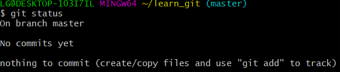
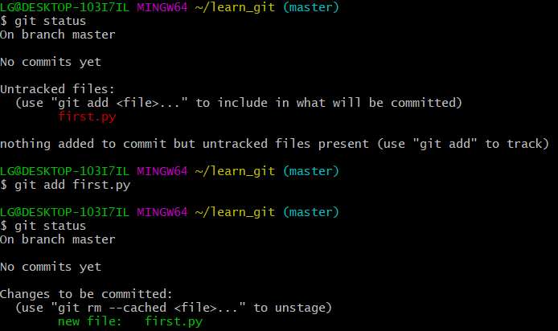
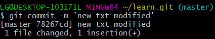

# Git - Basic

## Git이란?

파일의 변경사항을 추적하고 여러 사용자들 간의 작업을 조율하기 위한 분산 버전 관리 시스템이다. 무료이고 오픈소스들을 제공해 빠른 속도와 효율성을 가지고 크고 작은 프로젝트들을 다룰 수 있다. 


## Git 설치

1. git-scm.com 에서 다운로드
2. 계속 next로 설치


## Git 사용법


### 최초 설정

컴퓨터에 처음 git을 설치하면 사용자의 이메일과 닉네임 적어준다. 앞으로 일어나는 커밋에 서명을 하기 위해서 필요하다.

```
$ git config --gloabal user.email 'email'

$ git config --global user.name 'name'
```

잘 설정되었나 확인하려면

```
git config user.email

git config user.name
```

이메일과 이름을 출력할 수 있다. 


### 상태점검

`git status`



수시로 해주기


### 초기화

초기화는 `git init`을 통해 진행한다.

```
$ git init
```


(master) 는 그 자식들에게 모두 영향


### Stage 올리기

untracked 상태인 디렉토리의 파일들은 stage에 올려야 commit할 수 있다.

tracking을 하려면 `$ git add`을 이용하면 된다.

```
$ git add <filename>
```



`$ git status`를 통해 상태를 확인해보면 처음에는 untracked였던 first.py(빨간색)가 초록색으로 변한다.


### Stage 내리기

`$ git restore --staged <filename> `을 이용하여 내릴 수 있다.


### Commit 하기

반드시 stage에 올라와있는 상태여야 하며, `$ git commit -m 'msg'`로 저장한다. (주의 : `$ git commit `만 입력하게 되면 어딘가에 처박힘. 이럴때는 Esc 연타 후 `:qa!`로 빠져나온다. )

msg는 어떤 내용인지 혹은 수정내용이 명확하게 드러나도록 작성.

``` 
$ git commit -m 'msg'
```




### Log 보기

```
$ git log
```

`$ log -n`  최근 n개만 보기

`$ git log --pretty=oneline` 한줄로 보기

`$ git log --pretty=format:"%h %s" --graph` 간단한 포맷으로 보기


### 원격 저장소 등록하기

```$ git remote add origin <URL>
$ git remote add origin <URL> #origin 키로 url 등록

$ git remote -v #확인하기
origin <URL>...

$ git remote rm <remote_repo_name>
```


### 원격 저장소에 push 하기

```$ git push origin master #origin을 master에 밀기
$ git push origin master 
```

master의 내용들을 origin으로 밀어주기


### 원격 저장소에서 pull 하기

```
$ git pull origin master
```


## Summary

| 명령어                              | 설명                                        |
| ----------------------------------- | ------------------------------------------- |
| `$ mkdir`                           | 폴더 만들기                                 |
| `$ touch`                           | 파일 만들기                                 |
| `$ rm (/-r/-rf)`                    | 삭제 (파일/폴더/강제적으로 다)              |
| `$ cd <dir>` / `$ cd ..`            | 디렉토리 들어가기 / 위로 가기               |
| `$ ls  (-a)`                        | 리스트 (숨겨진 파일까지)                    |
| `$ git init`                        | 빈 디렉토리를 git 저장소(repo)로 초기화하기 |
| `$ git add <filename> `             | 스테이지에 올리기 (전부)                    |
| `$ git commit -m "commit msg"`      | 스테이지에서 커밋하기                       |
| `$ git log`                         | 지금까지의 기록 보기                        |
| `$ git restore --staged <filename>` | 스테이지에서 내리기                         |
| `$ mv <before> <after>`             | 이름 변경                                   |
| `$ git remote add origin <URL>`     | remote repo(url)로 키 값(origin) 등록       |
| `$ git remote -v`                   | 확인하기                                    |

#### 심화교육

the missing semester

