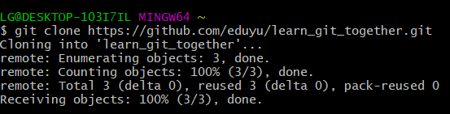
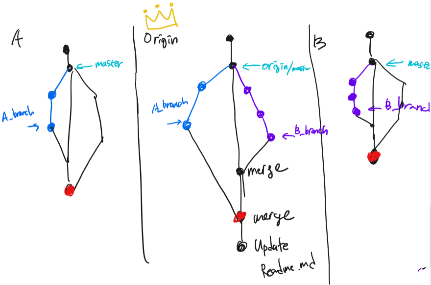

# Git - Intermediate


## Branch


### Branch 생성

```
$ git branch <branchname>
```

#### Branch 생성하면서 넘어가기

​	`$ git switch -c <branchname>` 

​	`$ git checkout -b <branchname>`

​	새로 생성된 branch로 head가 넘어감.


### Branch 옮기기

```
$ git switch <branchname>
```

head가 <branchname>으로 옮겨간다.


### Branch 확인

```
$ git branch
```

모든 branch의 종류와 현재 head 위치 *표시


### Branch 합치기

```
$ git merge <branchname>
```

항상 master에서 다른 branch를 병합하기


### Branch 삭제

```
$ git branch -d <branchname>
```


## Branch로 협업하기


남이 공유한 Repo 받기

Home에서 `$ git clone <URL>`




branch 만들어서 작업하고 push 할 때 branch에서 push 

```
$ git push origin <branchname>
```


origin에서 merge 끝내고 pull 할 때 master에서 pull

```
$ git switch master

$ git pull origin master
```


간략한 설명도 (feat. 유태영 강사님)




## error 해결하기


## 파일 무시하기

특정 파일 untracked 상태로 유지하려면

`$ touch .gitignore`

만들고 .gitignore에 써놓기


이미 만들었으면 `$ git rm --cached <filename>` 으로 untracked로 만들기

`$ git rm -r --cached <foldername>`  #폴더일때


프로젝트에 맞는 .gitignore 파일 찾기

https://gitignore.io

