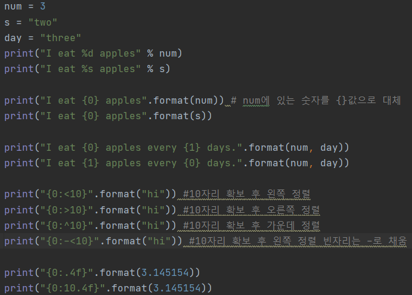

# Basic

* 참고 서적 : 파이썬 정복 by 김상형

* Pycharm 설치하기


## 연산자

* `a//b` : 소수 이하 버림
* `a % b` : 나머지
* `a ** b` : 거듭제곱
* `divmod(a,b)` : a(피젯수)를 b(젯수)로 나눈 몫과 나머지
* `==` : 같다
* `!=` : 다르다
* `x+=10` : x=x+10 축약형

```python
x=10
x*=2
#20
x/=5
#4
x%=3
#1

논리연산자
and 모두다
or 하나만
not 반대로
```


## 기본 구조


### 출력

```python
print(출력 내용 [, sep = 구분자] [, end = 끝 문자])
#[]는 생략 가능
```


* print 여러개 이어 쓰려면 `;`로 연결

  ```python
  >>>print('안녕');print('하세요')
  안녕
  하세요
  ```

  

* print 두개 붙여 출력하려면 `end = ''`

  ```python
  >>>print('안녕', end='');print('하세요')
  안녕하세요
  ```


### 입력

```python
변수 = input('질문 내용')
```


### 변수

* 파이썬은 변수 설정이 편리하다.

```python
a,b,c = 1,2,3 #변수와 값의 개수가 같아야 한다
```

* `a=None` : 변수만 만들고 값을 저장하지 않을때

* `a=''` : 변수 값이 공백

- `del a` : 변수 a 삭제

```python
x,y=1,2
x,y=y,x   #x,y 값 바꾸기
print(x,y)   
#2 1
```


## 타입

`str()` : 문자열로 변환

`int()` : 문자열을 정수로 변환(두번째 인수로 진법 지정)

`float()` : 실수로 변환


### 진수

| 진법   | 접두 | 사용 가능한 숫자 | 예     | print 명령 |
| ------ | ---- | ---------------- | ------ | ---------- |
| 16진법 | 0x   | 0~9,a~f          | 0x2f   | hex()      |
| 8진법  | 0o   | 0~7              | 0o17   | oct()      |
| 2진법  | 0b   | 0,1              | 0b1101 | bin()      |


### 확장열

* `\n` : 줄 바꾸기
* `\t` : 띄어쓰기(탭)
* `\"` : 큰따옴표 넣기
* `\'` : 작은따옴표 넣기
*  `\\` : \ 넣기
* 확장열 무효는 문자열 앞에 r 넣기  `r''`


#### 긴 문자열

```python
s = """엄청나게 길어서 한 줄에 다 쓸 수 없는 긴 문자열이라서 
중간에 개행되더라도 다음 큰따옴표 3개를 만날 때까지 
하나의 문자열로 정의한다."""
#개행, 띄어쓰기가 문자열의 일부로 포함됨

s = "엄청나게 길어서 한 줄에 다 쓸 수 없는 \
긴 문자열이라서 다음줄로 내려 쓰더라도 \
이후 줄이 하나의 문자열로 정의된다."
#코드의 가독성을 높인다
```


## 문자열 


### 문자열 전처리

* 변경

```python
.upper()
.lower()
.swapcase()
.capitalize()
.title()

.strip()
str=", python,."
print(str.lstrip(",")) 
# python,.
print(str.lstrip(", ")) #큰따옴표 안에 제거대상 문자 나열
#python,.
print(str.lstrip(" ,."))
#python,.
print(str.rstrip(" ,."))
#, python
print(str.strip(" ,."))
#python

import string
print((string.punctuation))
#!"#$%&'()*+,-./:;<=>?@[\]^_`{|}~
print(str.strip(string.punctuation)) #특수문자 다 걸러냄
print(str.strip(string.punctuation+" ")) #공백포함

```

* 검색

```python
a="hello"
print(a.count("l"))
#2
print(len(a))
#5
print(a.find('l')) 
#2
print(a.find('x')) 
#-1
print(a.rfind('l'))
#3
print(a.index('l'))
#2
print(a.index('x'))
#에러
print(a.rindex('l'))
#3

```

* 조사

```python
print('l' in a)
#True
print(a.startswith("h"))
#True
isalpha
islower
isupper
isspace
isalnum
isdecimal
isdigit
isnumeric
isidentifier
ispritable
```

* 문자열 삽입

```python
print(",".join("abcd"))
#a,b,c,d
print(",".join(['a','b','c','d']))
#a,b,c,d
#리스트 각각의 문자들이 컴마와 결합하여 하나의 문자열("a,b,c,d")이 됨
print("".join(['a','b','c','d'])) 
#abcd
```

* 치환 

```python
s="Life is too short"
print(s.replace("Life","Your leg")) #대소문자 구분
#Your leg is too short

변환테이블(t) 생성
t=str.maketrans('aeiou', '12345')
print('apple'.translate(t)) 
#1ppl2

문자열 폭 지정 후 글자 배치
print('python'.rjust(10))
#    python
s='python'.rjust(10)
print(s.upper())
#    PYTHON
print('python'.center(10).upper())
#  PYTHON  

padding:특정값으로 빈자리 채우기
print("hello".zfill(10)) 
print("345".zfill(10)) 
#00000hello
#0000000345
```

* 분할

```python
print(s.split()) #공백문자로 분리

s="Life$is$too$short"
print(s.split("$")) 
#['Life', 'is', 'too', 'short']
print('1,2,3'.split(','))
#['1', '2', '3']
```

* 정렬

```python
print('python'.ljust(10)) #10자리 확보 후 좌측 정렬
print('python'.rjust(10))
print('python'.center(10))
```


### 슬라이싱

```python
[begin:end:step] #끝자리는 포함 안함. 음수는 뒤에서부터
```


### 포매팅

문자열 사이사이에 다른 정보를 삽입하여 조립하는 기법

| 표식 | 설명      |
| ---- | --------- |
| %d   | 정수      |
| %s   | 문자      |
| %f   | 실수      |
| %%   | 퍼센트    |
| %c   | 문자 하나 |
| %h   | 16진수    |
| %o   | 8진수     |


```python
#문자열 뒤에 % 연산자와 표식 위치에 들어갈 값을 밝힌다.

x = 5
y = "apples"
print("I eat %d %s" % (x, y))

x="five"
d=2
per=30
print("I eat %s eggs every %d days for %d%% chance" % (x,d,per))
#I eat five eggs every 2 days for 30% chance
```


- format 메서드로도 가능




```python
#자리수 지정
%[-]폭[.유효자리수]서식

print("%10s" % "hi") 
#        hi
print("hello%10s" % "hi")
#hello        hi
print("%-10shello" % "hi")
#hi        hello      

%-10s #왼쪽 정렬
%.4f #소수 이하 넷째 자리까지 표현
%10.4f #우측에 10자리 확보 후 소수 이하 넷째 자리까지 표현
```


## 정리해 넣을것


## if 조건문

```python
x=1
if x==1:
    pass #코드를 수행하지 않고 넘어감
print(x)

in : 검사 
print('h' in "hello")
#True

elif : 조건이 여러개일때
money=6500
if money>=20000:
    print("taxi")
elif money>=10000:
    print("bus")
elif money>=5000:
    print("walk")
#walk
```

* 변수의 논리값

  | 타입                   | 참                  | 거짓    |
  | ---------------------- | ------------------- | ------- |
  | 숫자                   | 0이 아닌 숫자       | 0       |
  | 문자열                 | 비어 있지 않은 상태 | ""      |
  | 리스트, 튜플, 딕셔너리 | 비어 있지 않은 상태 | 빈 상태 |

* 논리 연산자

  | 연산자 | 설명                       |
  | ------ | -------------------------- |
  | or     | 두 조건 중 하나라도 참이다 |
  | not    | 조건을 반대로 뒤집는다     |
  | and    | 두 조건이 모두 참이다      |

  

  

## 반복문

### for

```python
for 변수 in 컬렉션(리스트, 튜플, 문자열):
    명령
```

* 연습

```python
for i in [(1,2),(3,4),(5,6)]:
    print(i)
#각 튜플이 i가 됨
for i,j in [(1,2),(3,4),(5,6)]:
    print(i)
    print(j)
#튜플의 요소가 i,j가 됨

for i in range(3,10,2):
    print(i)
#3 5 7 9

#구구단 2~9단 표현
for dan in range(2,10):
    for i in range(1,10):
        print(dan*i, end=" ")
    print("") #줄바꿈
    
```


### while

```python
while 조건:
    명령
```

* 연습

```python
i=0
while i<10:
    i=i+1
    print(i,"번째 반복 수행")
    if i>10:
        break #반복문 빠져나가기
        
prompt="""
1.취소
2.입력
3.종료
입력 :
"""

a=0
while a<10:
    a=a+1
    if a%2==0:continue #while의 시작위치로 이동
    print(a)
#1
#3
#5
#7
#9

#1~100사이의 자연수 중 4의 배수의 합 출력
num=1
sum=0
while num<=100:
    if num % 4 == 0:
        sum=sum+num
    num += 1
print(sum)
------------------or-------------------
num=0
sum=0
while num<100:
    num += 1
    if num % 4 == 0:
        sum=sum+num
print(sum)
```


## 함수

* bool() 불리안

```python
print(1==1.0) True #값 비교 
print(1 is 1.0) False #객체 비교
0:False 1:True #그 외 숫자나 텍스트도 참. 빈 문자열은 거짓

a=[4,5]
a=b
print(a is b) #a와 b가 가리키는 메모리상의 대상이 동일한가
#True

a=[1,2]
b=[1,2] 
print(a is b) #False
print(a==b) #True

#a 변수 값을 가진 다른 주소(c) 만들기
a=[2,4,6]
c=a[:]
print(a is c) #False
print(a==c) #True

from copy import copy #모듈에서 함수 가져오기
c=copy(a)
print(a is c) #False
print(a==c) #True
```

* `input()`

```python
a,b = input("두 수 입력 :").split()
#split앞에 있는 문자열을 공백으로 분리

a,b=(input("숫자 두 개 입력 : ").split())
print(int(a)+int(b))

a,b=map(int,input("숫자 두 개 입력 : ").split())
print(a+b)
```

* 최대,최소

```python
.max() : 최대
.min() : 최소
```

* `map()`

```python
함수출력=map(함수, 함수입력)
x1,x2=map(int, ['3', '4'])
print(x1+x2)
#7

x1, x2= map(int,  input("숫자 두 개 입력 : ").split())   
입력 : 1 2
#['1', '2']
#[1,2]
#x1=1, x2=2 #type==int
print(x1+x2)
#3

#컴마로 구분
x1, x2= map(int,  input("숫자 두 개 입력 : ").split(","))
입력 : 1,2
#['1','2']
#[1,2]
#x1=1, x2=2
print(x1+x2)
#3
```


```python
※ 내장 함수랑 객체 소속의 메서드는 호출 방식 다름
len(s) #내장 함수
s.find('a') #메서드

외장함수 : 별도로 적재를 해야 하는 함수
import random
print(random.random())  #난수 발생
#모듈명.함수명()
print(random.randint(1,10))
```


## 컬렉션

여러개의 값을 모아서 저장


### 시퀀스 자료형

 : list, tuple, 문자열, range, bytes, bytearray 등 값들이 연속적으로 저장된 형태

* 데이터 존재 유무 확인

  ```python
  찾고자하는 값 in 시퀀스객체
  
  print(30 in a) #True
  print(30 not in a) #False
  ```

* 시퀀스 객체 연결 ('+' 덧셈연산자)

  ```python
  a=[1,2]
  b=[3,4]
  print(a+b)
  #[1,2,3,4]
  
  a=(1,2)
  b=(3,4)
  print(a+b)
  #(1,2,3,4)
  
  #range 객체는 list나 tuple로 변경 후 연결
  print(list(range(0,4))+list(range(4,6)))
  #[0,1,2,3,4,5]
  
  #문자열+숫자> 숫자를 str로
  "hi"+str(100)
  ```

* 시퀀스 객체 반복('*' 곱셈연산자)

  ```python
  print([1,2]*2)
  #[1,2,1,2]
  
  #range는 list나 tuple로 변경 후 반복
  print(list(range(0,4,2))*2)
  #[0,2,0,2]
  ```

* 길이

  ```python
  s="안녕하세요"
  print(len(s))
  #5
  print(len(s.encode('utf-8')))
  #15
  #utf-8에서는 한 글자가 3byte
  ```

* 대괄호로 참조; 참조하여 삭제는 리스트만 가능 `del s[0]`

* slice 객체로 자르기

  ```python
  print(list(range(5,20)[slice(3,9,2)])
  #[8,10,12]
  
  #교체
  a=list(range(8))
  a[1:4]=['a','b','c']
  #[0,'a','b','c',4,5,6,7]
  ```


### 리스트: []

```python
','로 자료 구분하여 순서대로 저장
리스트는 리스트를 포함한 다양한 자료형을 요소값으로 저장 가능

b=[] 
b=list() #빈 리스트 생성

s="hello"
print(list(s))
#['h','e','l','l','o']

a=list(range(1,7))
#[1,2,3,4,5,6]

print(list(range(5))) #[0,1,2,3,4]
print(list(range(3,10))) #[3,4,5,6,7,8,9]
print(list(range(3,10,2))) #[3,5,7,9]
print(list(range(10,0,-1))) #[10,9,8,7,6,5,4,3,2,1]

#'too' 출력
a=[1, 2, ['life', 'is',['too', 'short']]]
print(a[2][2][0])
print(a[-1][-1][-2])
```


* 리스트 컴프리헨션

```python
문법으로 요소의 집합 정의하기
nums=[n*2 for n in range(1,7)]

nums=[]
for n in range(1,7):
    nums.append(n*2) 
#[2,4,6,8,10,12]

#3의 배수만 취하려면 if문으로 조건 작성
nums=[n*2 for n in range(1,7) if n%3==0]
#[6,12]
```


* 리스트 슬라이싱

```python
[begin:end:step]

x=[10,20,30,40,50]
print(x[1:4:-1]) #1부터 3번 요소까지 -1간격으로

a=[1,2,3,['x','y','z'],4,5]
print(a[3][:2])
#['x','y']
```


* 리스트 연산

```python
b=[1,2,3]
print(b[0]+b[2])
#4

a=[1,2]
b=[3,4]
print(a+b)
#[1,2,3,4]
print("ab"+"cd")
#abcd

print(a*3) #[1,2,1,2,1,2] a가 3번 반복
print("ab"*3) #ababab
print(len(a)) #2

print(a[0]+"hi") #에러 발생. 정수와 문자열은 더할 수 없다
print(type(a[0])) #int
print(type("hi")) #str

str(a[0]) # 숫자 1 -> 문자열 "1"
print(str(a[0])+"hi")  => 1hi 출력
#str 함수: 정수나 실수를 문자열로 변환해주는 함수
```


* 리스트 값 변경

```python
a=[1,2,3]
a[2]=30 
#a=[1,2,30]

a=[0,1,2,3,4,5,6]
a[1:4]=[10,20,30]
#a=[0,10,20,30,4,5,6]
```


* 리스트 추가, 확장, 삽입(append, extend, insert)

```python
a=[1,2,3]
a+=[4]
a.append(4) #리스트 끝에 요소 추가
#둘다 a=[1,2,3,4]

a.append([5,6,7]) #리스트 추가
#a=[1, 2, 3, 4, [5, 6, 7]]

a+=[5,6,7]
a.extend([5,6,7]) 
#[1,2,3,5,6,7]

a.insert(1,4) # 1번 요소에 4 추가
#a=[1,4,2,3]

nums = [1,2,3,4]
nums[2:2] = [90,91,92] #삽입
#[1,2,90,91,92,3,4]
print(num.insert(2,[90,91,92]))

nums = [1,2,3,4]
nums[2] = [90,91,92] #대체
#[1,2,90,91,92,4]
```


* 리스트 값 제거(del, remove, pop)

```python
#del : 위치 삭제. 내장함수
a=[10,20,30]
del a[1]
#a=[10,30]

a=list(range(1,10))
del a[:5] #0~4번 index까지 삭제
#a=[6,7,8,9]

#remove : 값 삭제
a=[10,20,30,10,20,30]
a.remove(30) #첫번째 30만 제거, 없는 요소값을 입력하면 에러 발생
a.remove(30) #두번째 30 제거
#a=[10,20,10,20]

a=[10,20,30,40,50]
a[1:4]=[]
print(a)
#[10,50]

#pop : 가장 마지막 위치의 데이터 제거 후 삭제한 요소를 리턴
a=[10,20,30]
print(a.pop())
#[30] 
a.pop()
#a=[10]
```


* 리스트 정렬

```python
a=[3,5,6,2]
a.sort() #오름차순
a.reverse() #뒤집기
a.sort(reverse=True) #내림차순

단, 이렇게 출력하면 안됨
print(a.sort()) 
#None

#sorted는 정렬된 새로운 리스트를 만들어 리턴하므로 별도의 변수 대입
b=[3,7,8,5]
b2=sorted(b)
print(b2)
#[3,5,7,8]
```


### 튜플: ()

```python
t=()
t=tuple()
tu=2, #요소가 하나면 일반 변수랑 구분안돼서 값 다음에 콤마 찍어 튜플 표시
t0=5,6,7 #만들때 괄호 안써도 됨

tuple(range(5)) #(0,1,2,3,4)
tuple(range(1,9,2)) #(1,3,5,7)

s="hello"
print(tuple(s))
#('h','e','l','l','o')

#unpacking
tu="김","이","강"
kim,lee,kang=tu
print(lee) #이
print(kim) #김
print(kang) #강

#swap
a,b=12,34
a,b=b,a
print(a,b)
#34,12
```

* 튜플은 값을 변경할 수 없다.

```python
t1[1]=20 #불가능
del t1[1] #불가능

#값 변경 (튜플>리스트>요소값 변경)
x=tuple(range(1,5)) #튜플생성
print(list(x)) #리스트로 변경
tempx=list(x) #리스트로 새로 저장
tempx[2]=30 #요소값 변경
print(tempx)

y=[1,2,3]
tempy=tuple(y) #리스트>튜플
```

* 변수를 여러개 쓰면 튜플 내의 값들에 순서대로 저장됨.

```python
ex1, ex2 = divmod(9,4)
#ex1=2, ex2=1 

1,2,3=(a,b,c)
```

* 연산

```python
t1=(1,2,3)
t2=('a',3,4)
t3=5,6 
print(t1[:2]) #(1, 2)
print(t1+t2) #(1, 2, 3, 'a', 3, 4)
print(t3*5) #(5, 6, 5, 6, 5, 6)
print(t1+(7,8)) #(1,2,3,7,8)
```


### 딕셔너리: {}

```python
키와 값의 쌍을 저장하는 대용량 자료구조
해시 알고리즘을 사용하여 일대일로 대응되는 특성이 있어 맵이라고도 부름.
연관배열이라고도 함.

dic={'name':'kim','add':'seoul','nn':['사과','바나나']}
#키가 중복되면 마지막에 저장한 값이 남는다.
#키는 고유값, 값은 중복가능
#키에 딕셔너리, 리스트 등 자료구조 안됨. 튜플은 가능
#순서 없음

dict(name='kim',add='seoul',nn=['사과','바나나'])

#zip 객체를 dict로 변환
#dict(zip([키 리스트],[값 리스트]))) 
print(dict(zip(['a','b'],[1,2]))) 
#{'a': 1, 'b': 2}

#키로 검색한다. 수 만개 있어도 빠름
print(dic['name'])
#kim

#키가 있는지 확인
dic={'boy':'소년','id':'홍길동','school':'학교'}
print('age' in dic)
#False

#요소 개수
print(len(dic))

#키가 없는 경우 
#.get으로 None리턴
dic={'name':'kim','add':'seoul','nn':['사과','바나나']}
print(dic.get('age'))
#None
print(dic.get('age','사전에 없는 단어'))
#두 번째 인수로 대신 돌려줄 디폴트값 지정

li=[('nn','bear'),('add','seoul'),('age','10')]
dic=dict(li) 
#리스트나 튜플로 딕셔더리 생성 가능
```


* 삽입, 삭제, 수정

```python
dic={'nn':'bear','add':'seoul','age:10'}
dic['nn']='pup' #수정
dic['height']='170' #삽입
del dic['age'] #삭제
print(dic)
#{'nn':'pup','add':'seoul','height':'170'}

word={'boy':'소년','school':'학교'}
word2={'student':'학생'}
word.update(word2)
print(word)
#{'boy':'소년','school':'학교','student':'학생'}

dic={'nn':'bear','add':'seoul','age:10'}
print(dic.keys()) #키만 추출
print(dic.values()) #값만 추출
print(dic.items()) #키와 값 쌍으로 추출

#요소 추출하려면 리스트로 만들기
mykey=dic.keys()
listmykey=list(mykey)

dic.clear() #모든 요소 제거
```


### 집합: Set{}

```python
순서 없음
키 중복 안됨
값을 포함하고 있느냐 아니냐만 중요하다.

s1=set([1,2,3,4,2]) #리스트 자료를 기초로 집합(중복 제외) 생성
#{2,4,3,1}
s2=set("hihello")
#{'h', 'o', 'l', 'i', 'e'}
s3={'blue':'sky','pink':'blush','red':'blank'}
#{'blue','pink','red'}

#교집합
s1&s2
s1.intersection(s2)

#합집합
s1|s2
s1.union(s2)

#차집합
s1-s2
s1.difference(s2)
```

* 편집

```python
add함수 : 하나만 추가
s3=set()
s3.add(3)
#{3}
s3.add([3,4]) #리스트 안됨

update함수 : 여러 개 추가
s3.update([1,2,3,4])
#{1,2,3,4}
s3.update([1,5,7])
#{1,2,3,4,5,7}

remove : 하나만 제거
s3.remove(2)
#{1,3,4,5,7}
```

