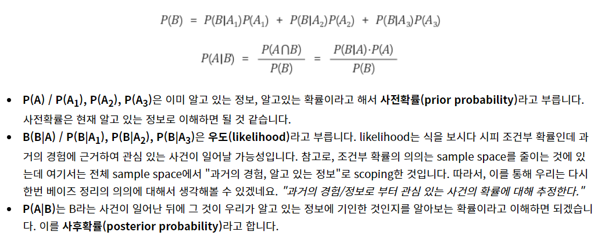

## 베이지안 확률




```ㄱ
메일 : free => spam?
  
스팸 확률 0.3
free 포함 확률 0.4
스팸 중 free 포함 확률 2/3

베이지안 확률
P(spam|free)=P(free|spam)*P(spam)/P(free)
2/3 * 0.3 /0.4 = 0.5

1) 나이트=예, 돈=아니오, 식료퓸=아니오, 구독취소=예인 경우 스팸일 확률
P(스팸|나이트,-돈,-식료품,구독쥐소)
메모리 너무 커서 어려움

전부 조건부 독립으로 가정하고

분자 = P(스팸)*P(나이트,-돈,-식료품,구독취소|스팸)
  = P(스팸)*P(나이트|스팸)*P(-돈|스팸)*P(-식료품|스팸)*P(구독취소|스팸)
분모 = 무시(상수취급)

2) 같은 조건에 햄일 확률


=================================
우도가 0이 되지 않기 위해
라플라스값 =1 인 우도값=분자에 1씩더하고 더하게 된 값을 분모에 추가

분류기준은 범주형이어야함
```

