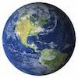

# CSS

:웹페이지에 출력할 내용과 스타일을 분리하기 위해 생겨남

어떤 태그들에게 어떤 스타일 효과를 적용하는 언어.


### `<style>` 이용하는 3가지 방법

1. 태그에 style 속성

   ```html
   <div style="color:red">문서입니다</div>
   ```

   <div style="color:red">문서입니다</div>

   

2. html 문서의 style 태그

   ```html
   <style type="text/css">
       .my-text{color:blue}
   </style>
   ```

   <!--my text라는 클래스로 묶인 내용의 글자 색상을 파랑색으로 설정-->


3. **선택자** : 어떤 태그들에 스타일을 적용할 것인지 정의하기 위한 문법

   ```html
   >>>tag 선택자
   태그{속성1:값;속성2:값;}
   
   >>>id 선택자 (보통 개별 속성 나타낼때)
   #아이디{속성1:값;속성2:값;}
   
   >>>class 선택자 (보통 같은 속성을 통채로 정의할때)
   .클래스{속성1:값;속성2:값;}
   
   <!DOCTYPE html>
   <html lang="en">
   <head>
       <meta charset="UTF-8">
       <style>
           h3{color:#F00;}
       	span{color:#00F;}
       	#mybox{background-color:#F0B;width:200px;height:40px;}
           .yourbox{background-color:#AB0; width:200px;height:40px;}
       </style>
   </head>
   <body>
       <h3>태그로 정의된 제목</h3>
       <span>태그로 정의된 스타일</span>
       <div id="mybox">id로 정의된 스타일</div>
       <div class="yourbox">class로 정의된 스타일</div>
     
   </body>
   </html>
   ```

   ```html
   >>>부모자식 선택자
   선택자1 선택자2{속성1:값; 속성2:값;...}
   
   <!DOCTYPE html>
   <html lang="en">
   <head>
       <meta charset="UTF-8">
       <style>
           div.yellowbox span{background-color:yellow;}
           div>span.blue_span{background-color:blue;}
           
           .aa >.bb>.cc{color:red}
           .aa .bb{color:skyblue}
           .xx .yy{color:green} <!--중간 뛰어넘기 가능-->
           
       </style>
   </head>
   <body>
       <div class="yellowbox">
           <span>부모자식 태그로 정의된 스타일</span></div>
       <div>
           <span class="blue_span">부모자식 태그로 정의된 스타일</span>		</div>
       
       <div class="aa">
       	<div class="bb">중간에 낀 bb
           	<div class="cc">aa와 cc</div>
       </div></div>
       <div class="xx">
           <div class="kk">중간에 낀 kk
               <div class="yy">xx와 yy</div>
           </div>
       </div>
       
   </body>
   </html>
   ```

   ```html
   >>>다중 조건 선택자: AND, OR (선택자 사이에 공백)
   
   or 조건
   #아이디, .클래스{}
   태그, .클래스{}
   
   <head>
       <style>
           div.box{color:red;}
           div, .box{color:skyblue;} 
           <!--div태그이거나 클래스가 box면 하늘색-->
           
       </style>
   </head>
       <div class="box">box</div> <!--빨강 조건이 우선-->
   	<div>div태그</div> <!--하늘색-->
   	<span>span</span> <!--하늘색-->
   ```

   

## 속성

### color

```html
#000000:검정, #FFFFFF:하양 #00f:파랑
background-color:배경색
color:글자색

1)html(body에 있는 태그에 작성)
	<div style="color:red">text1</div>
    <div style="color:#f00">text2</div>
    <div style="color:rgb(255,0,0)">text3</div>
    <div style="color:rgba(255,0,0,0.5)">text4</div> <!--a는 불투명도(0~1) 클수록 불투명-->
2)css : style 태그에 color속성(head에 작성)
<head>
    <style>
        .box{
        background-color:#09c;color:#00f;
        }
	</style>
</head>
<body>
    <div class="box">색상확인</div>
</body>
	
```

### align

```html
>>>text
클래스/아이디명{text-align:left/right/center;}
>>>bg img
{background-position:center/픽셀값;}
```


### hover&focus

```
hover:마우스를 올리면(roll-on) 나타나는 속성
클래스/아이디명:hover{}
focus:클릭하면 나타나는 속성
클래스/아이디명:focus{}
```

```html
<!DOCTYPE html>
<html lang="en">
<head>
    <meta charset="UTF-8">
    <title>Title</title>
    <style>
        .box{
        background-color:#09c;
        }
        .hover-box:hover{color:orange;}
        .focus-input:focus{background-color:yellow;}
    </style>
</head>
<body>
    <div class="box hover-box">마우스를 올려주세요</div>
    <div class="hover-box">마우스를 올려야 보이는 글</div>
    <input tyle="text" value="click me" class="focus-input">
</body>
</html>
```


### margin&padding

```html
{margin:바깥쪽 여백}
{padding:안쪽 여백}

값이 1개면 상하좌우 같은값
2개면 상하, 좌우 같은값
3개면 상 좌우 하
4개면 상 우 하 좌(시계방향)
margin-top:위쪽만
margin-left/right:왼쪽,오른쪽만
margin-bottom:아래쪽만

```

```html
<html>
<head>
    <meta charset="UTF-8">
    <style>
	.box-container{
		background-color:skyblue;
		border: 2px solid #00F;
		margin: 5px 15px;
	}
	.box-container div{
		width: 120px;
		height: 80px;
		background-color: #fde6ff;
		border: 2px solid #90C;
		font-size: 15px;
	}
	#box1{ margin: 10px;  padding: 0; }
	#box2{ margin: 5px 25px; padding: 0; }
	#box3{ margin: 0;  padding: 10px 30px 5px; }
	#box4{ margin: 10px; padding: 10px 20px; }
	#box5{ margin: 10px 30px 0 50px; padding: 30px 0 }    </style>
</head>
<body>
	<div class="box-container">
		<div id="box1">m: 10<br>p: 0</div>
	</div>
	<div class="box-container">
		<div id="box2">m: 5 25<br>p: 0</div>
	</div>
	<div class="box-container">
		<div id="box3">m: 0<br>p: 10 30 5</div>
	</div>
	<div class="box-container">
		<div id="box4">m: 10<br>p: 10 20</div>
	</div>
	<div class="box-container">
		<div id="box5">m: 10 30 0 50<br>p: 30 0</div>
	</div>
</body>
</html>
```


### border

```html
<style>
    .border-styles>p{
    border:6px dotted #0f0;
    border-bottom:outset black
    }
</style>

solid:실선
dotted:점선
dashed:파선
double:이중선
groove:액자식 위가 어두움
ridge:액자식 아래가 어두움
inset:위에 그림자
outset:아래 그림자
```


### font

```json
font-size:20px #글자크기
font-weight:bold #글자굵기
font-style:italic #글자스타일
font-family:"궁서" #글자체
```

```html
<html>
<head>
	<meta charset="utf-8">
	<style>
		#text1{font-size:20px}
		#text2{font-size:40px}
		#text3{font-size:60px}
		.bold{font-weight:bold}
		.italic{font-style:italic}
		.jinji{font-family:"궁서"}
		#text4{font:italic bold 50px serif;}
	</style>
</head>
<body>
	<div id="text1">20픽셀</div>
	<div id="text2">40픽셀</div>
	<div id="text3">60픽셀</div>
	<div class="bold">굵은</div>
	<div class="italic">이탤릭</div>
	<div class="jinji">궁서</div>
	<div id="text4">altogether possible</div>
</body>
</html>
```


### img

```html
원본 이미지 크기보다 작으면 잘리고
				  크면 반복되서 나온다.
<style>
    #box1-1{width:100px;height:100px;background-image:url("earth.jpg");}
</style>
<body>
    <div id="box1-1"></div>
</body>

반복
{background-repeat:repeat} #default
안되게 하려면 
{background-repeat:no-repeat;
background-position:center 10px; 좌우는 가운데 정렬,위 10px

} 
x축 부분만 반복
{background-repeat:repeat-x;}

y축 부분만 반복
{background-repeat:repeat-y;}
<style>
    .abox{
    width:500px;
    height:100px;
    background-image:url("earth.jpg");
    margin-bottom:20px;
    }
    #box{
    background-repeat:no-repeat;
    }
    #box2{background-repeat:repeat;}
</style>
</head>
<body>
	<div class="abox">오른쪽</div>
	<div class="abox" id="box"></div>
    <div class="abox" id="box2"></div>

</body>
```


### container

```html
텍스트나 이미지에 맞춰서 박스 크기가 변하도록

<style>
    .float-container{
    width:300px;
    border:3px solid #0f0;
    }
    .float-container img{
    float:left;
    border:2px solid;
    margin:10px;
    }

</style>
</head>
<body>
	<div class="float-container">
	지구가 아파요.지구가 아파요.지구가 아파요.지구가 아파요.지구가 아파요.지구가 아파요.지구가 아파요.지구가 아파요.지구가 아파요.
</body>
```


### cursor

```html
커서모양 바꾸기(html)

<div class="cursors">
	<span style="cursor:crosshair">crosshair</span>
	<span style="cursor:pointer">pointer</span>
	<span style="cursor:move">move</span>
	<span style="cursor:e-resize">e-resize</span>
	<span style="cursor:wait">wait</span>
</div>
```


### visibility&display

```html
visibility:안 보이는 자료는 빈칸으로 나온다.
#boxh{visibility:hidden;}
#boxv{visibility:visible;}

display:안보이는 자료는 공간도 없다.
.disp{display:none;}
인라인태그에 높이너비 줄 때
.block1{dispaly:inline-block}
```


### position(?)

```html
position:static 그냥 박스 만들때 자리 정해지는 것
position:relative 직전 박스에 맞춰서 상대적인 위치
position:absolute 절대적인 위치 지정

<!DOCTYPE html>
<html lang="en">
<head>
    <meta charset="UTF-8">
    <title>Title</title>
    <style>
        .box-container{
        width:200px;border:2px solid #eee;
        }
        .box-container div{
        width:200px;border:2px solid green;
        background-color:yellow;
        padding:10px;
        }
        #box1{position:static; top:20px;left:30px;}
        #box2{position:relative; top:30px;left:50px;}
        #box3{position:absolute; top:30px;left:30px;}
    </style>
</head>
<body>

    <div class="box-container">
        <div id="box1">static박스</div>
        <div id="box2">relative박스</div>
        <div id="box3">absolute박스</div>
    </div>
</body>
</html>
```


