# Django


## 환경설정

- 명령프롬프트에서 python치면 바로 연결되게 고급설정
- C드라이브에 가상환경 폴더 venvs 만들기

#### 장고가 설치된 가상환경

- 파이썬 가상환경 만들기(venv모듈 사용해서 mysite이름의 가상환경 생성)

  `python -m venv mysite`  ( => mysite 폴더도 만들어짐)

- mysite->Scripts->들어가서 `activate`하여 가상환경 들어가기

  +activate 명령어는 Scripts 안에 있음

  +Scripts 안에 장고도 있고 파이썬도 있음


- 장고 깔기 `pip install django==3.1.3`

- 업그레이드 하라고 뜨면 `python -m pip install --upgrade pip`

  *명령어 잘 보고 적당히 변형해서 적용하기*

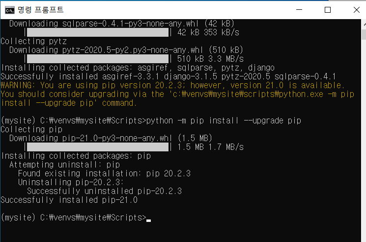

- 끌 때는 `exit`

#### 루트 디렉토리

- c\에서 새로운 폴더 **project** 만들기

- C:\project>`C:\venvs\mysite\Scripts\activate`입력해 가상환경 연결

  ```
  가상환경 : 프로젝트를 독립적으로 수행하기 위해 사용
  (서로 다른 버전에서 개발 가능)
  ```

- 또 mysites폴더 만들고 그 안에 <strong>장고 프로젝트</strong> 시작

  `django-admin startproject config .`
  
  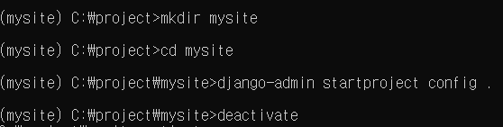

- 가상환경 나가려면 `deactivate`

- 웹서버 구동

   `python manage.py runserver`

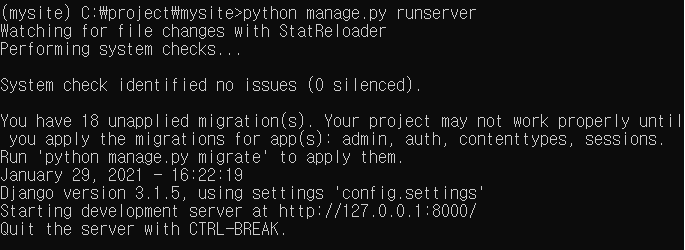

​		※헷갈려서 mysite->mysites로 바꿈

- 초기 마이그레이션(데이터베이스 및 User, Group 테이블 생성)

  `python manage.py migrate`

  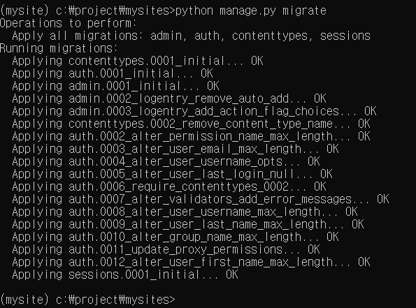

- 관리자 계정 생성

  `python manage.py createsuperuser`

  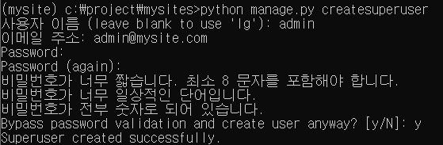

  http://localhost:8000/admin 에 로그인하면 게시판 확인가능

  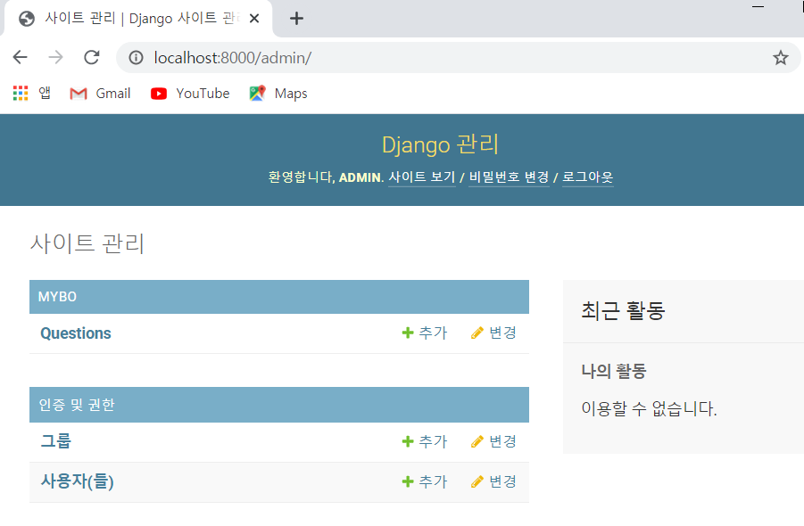

#### 내가 그린 요약도

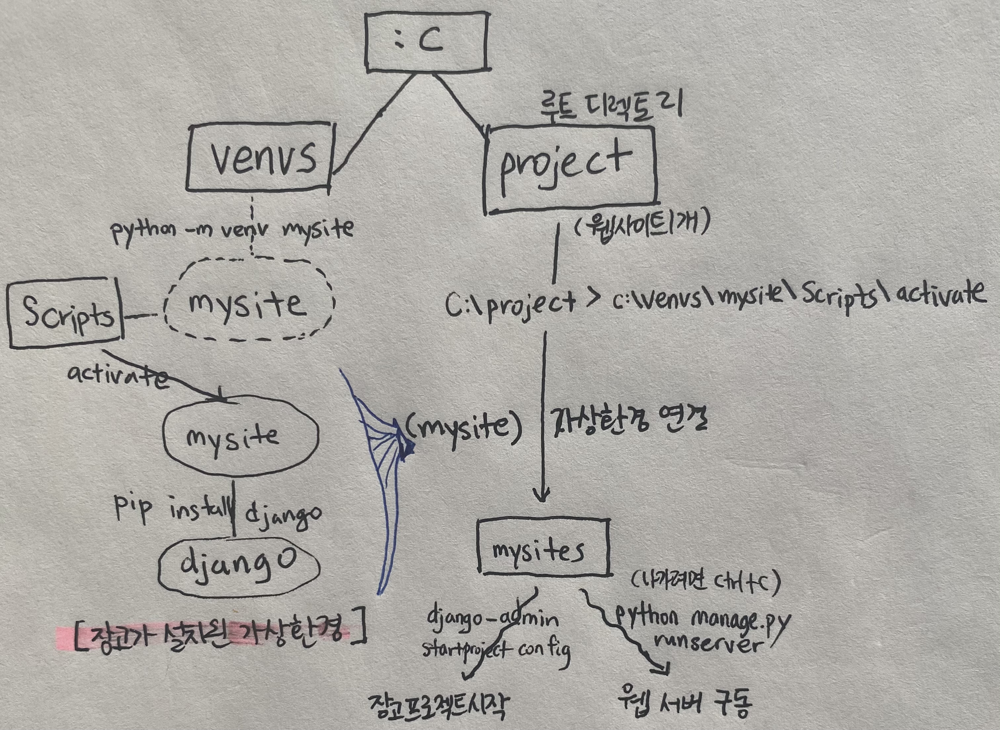


잘 됐는지 브라우저에 http://127.0.0.1:8000 나 http://localhost:8000로 확인

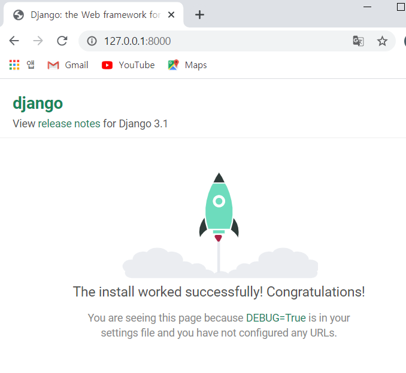


※**부록** : 매번 가상환경 연결 주소 치기 귀찮으니 명령창에 `mysite`만 줘도 (mysite)가상환경 연결되게 설정하기

```
메모장에
"@echo off
cd c:/project/mysites
c:/venvs/mysite/scripts/activate"
다른이름으로 저장->venvs에 저장(시스템파일로 자동 변경됨)
내PC->고급설정->환경변수->Path에 'C:\venvs' 경로 추가

이제 명령창에 mysite만 쳐도 어디에 있든 project\mysites 가상환경으로 연결됨
```


#### 파이참 연결

: 파이참에 파이썬도 가상환경에 있는 파이썬으로 연결해주어야한다

- existing environment에서 경로-> venvs\mysite\Scripts\python.exe

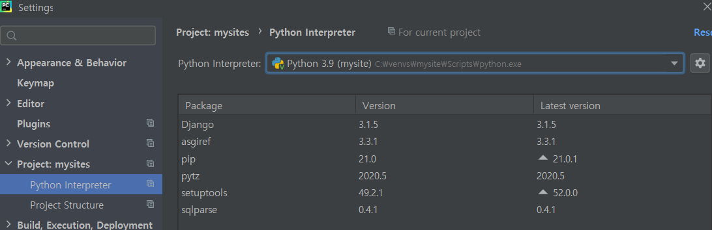

- settings.py에서 

```
LANGUAGE_CODE = 'ko-kr'

TIME_ZONE = 'Asia/Seoul'
```

​	로 변경해주면 웹사이트 한국어로 나온다.


#### DB Browser for SQLite

: 데이터베이스 관리 도구. sqlitebrowser.org/dl에서 다운로드

- 데이터베이스 열기 ---> project\mysites\db.sqlite3


<i>※ sql 몰라도 장고 ORM(Object Relational Mapping)이 파이썬으로 데이터 작업 할 수 있음</i>


## mysites 프로젝트

: mysites는 내가 만드려는 웹사이트 이름인 셈.


### 게시판 

- mybo라는 게시판 앱 설치

  `django-admin startapp mybo`

- 게시판 주소는 http://127.0.0.1:8000/mybo 가 된다.

- 동작 과정

```
1) http://127.0.0.1:8000/mybo 페이지 요청
2) 장고가 url 매핑 확인(config/urls.py에서)
3) 등록되어 있으면 해당 페이지 제공, 안됐으면 404 오류
```

#### url 매핑

```python
1) 주소로 가보면 404오류가 남.
2) config/urls.py에서 매핑

from django.contrib import admin
from django.urls import path
from mybo import views

urlpatterns = [  #앞에 호스트 주소는 생략가능
    path('admin/', admin.site.urls),
    path('mybo/', views.index), #views파일의 index로 직접 매핑  
	path('mybo/', include('mybo.urls')), #mybo로 시작되는 호출은 모두 mybo/urls.py의 매핑 규칙을 참조

]
```

```python
mybo/urls.py에 따로 매핑 규칙 적기

from django.urls import path
from . import views #.은 현재 디렉토리

urlpatterns=[
    path('',views.index), #mybo 써줄 필요 없어서 ''

]
```

- 실행했을 때 에러 : `AttributeError: module 'mybo.views' has no attribute 'index'`

```python
3) mybo/views.py에서 설정

from django.http import HttpResponse

def index(request):
    return HttpResponse("제가 만든 홈페이지입니다.")
```


장고는 모델로 데이터 관리

데이터 저장, 조회 삭제는 sql 쿼리문 사용

migrate 명령: admin, auth, sessions 등의 앱이 필요로 하는 테이블을 생성

테이블=데이터를 저장하는 집합

데이터베이스=테이블 ...의 모음


#### QnA

:질문하고 답하는 게시판 만들기


- 장고는 모델을 이용하여 테이블을 생성한다

```python
mybo/models.py

from django.db import models

# Create your models here.
class Question(models.Model):
    subject=models.CharField(max_length=200) #제목속성.글자수제한
    content=models.TextField() #게시글 본문
    create_date=models.DateTimeField() #게시일

class Answer(models.Model):
    question=models.ForeignKey(Question, on_delete=models.CASCADE) #모델간의 연결
    #답변과 연결된 질문이 삭제되며 답변도 삭제된다
    content=models.TextField() #답변글 본문
    create_date=models.DateTimeField() #게시일

```

​	※ model field references : 

[Model field reference | Django documentation | Django (djangoproject.com)](https://docs.djangoproject.com/en/3.0/ref/models/fields/#field-types)


- 설치된 앱에 추가하여 인식시키기(apps.py에 있는 class명 추가해주기)

```python
mybo/settings.py 안의 INSTALLED_APPS에
'mybo.apps.MyboConfig' 추가
```

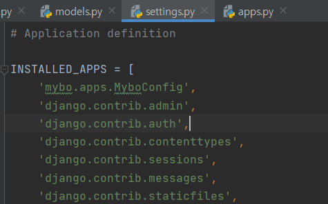


- 새롭게 테이블을 생성/수정하는 경우에는 먼저 테이블 작업에 필요한 파일을 만든다.

  테이블 생성 명령 : `python manage.py makemigrations`

  `mybo\migrations\0001_initial.py` 파일과 모델들 만들어짐

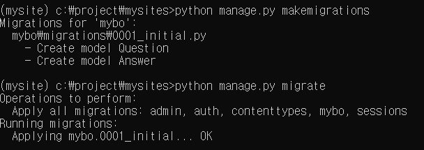

- 만든 모델들이 데이터베이스에 잘 들어가 있다.

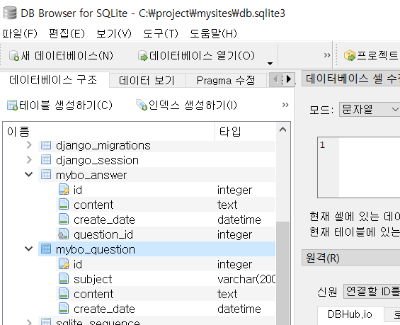

##### shell

: 코드로 직접 작성할 때

`python manage.py shell`

- 모델 불러와서 작성

  `from mybo.models import Question, Answer`

- 테이블 내용을 작성하고 저장하면 자동으로 번호가 붙는다.

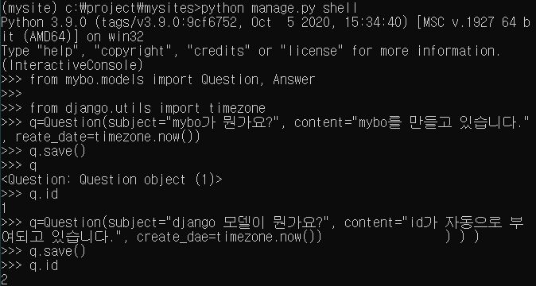

​	` Question.objects.all()` : Question모델 객체 전체 id 출력

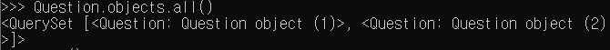

- 내용 변경 (method 추가 등)

  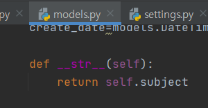

  `quit` 후 재시작해야 새로고침 된다. 

  ` Question.objects.all()` : Question모델 객체 전체 subject 출력

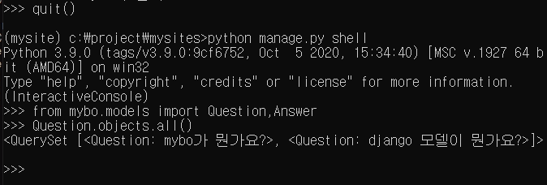

###### .objects.+

- `filter` : 

  - <QuerySet 리스트형태 >로 나열. 

  - 여러 건의 데이터를 리턴할때 쓴다. 

  - 없으면 빈 리스트를 리턴한다.

    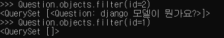

- `get` : 
  - 한 건의 데이터를 리턴할 때 쓴다. 
  - 없으면 에러

- 데이터 수정(save 해줘야함)

  재정의하면 됨. 검색할때 (속성명__contains='찾는단어')

  

- 데이터 삭제

  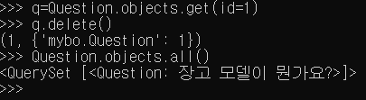


**질문 모델에 연결된 답변 모델 작성하기**

- 질문에 연결된 답변 찾을 때 답변이 여러 개일 수 있기 때문에 `_set.all()`함수 쓴다.

  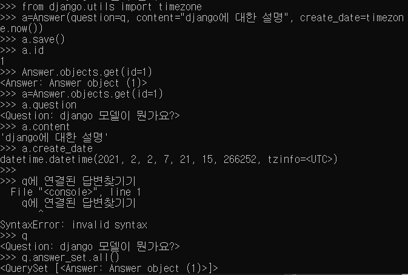

힘들어서 정리는 여기까지..