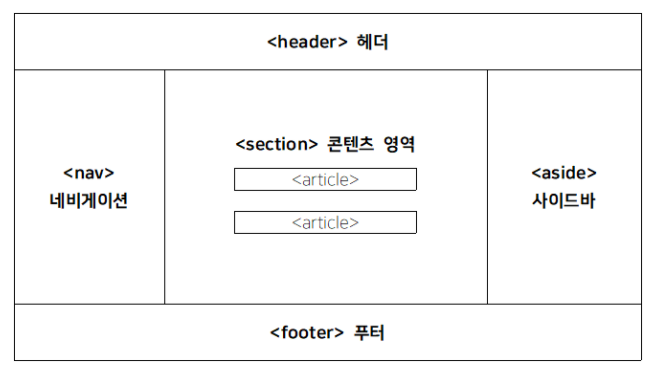

# HTML

: **HyperText Markup Language**

​	<b>HyperText</b>

하이퍼텍스트를 찾아봤더니 많은 양의 정보를 효과적으로 연결하고 관리하기 위한 기계에서 비롯되었다고 한다. 글을 읽거나 사전을 찾을 때처럼 처음부터 순차적으로 책장을 넘기는 것이 아닌, **사용자가 선택하여 원하는 방향으로 정보를 찾아나가는** 형식이라고 할 수 있다. 따라서, HTML에서는 정보 간의 연결이 중요하다.

​	<strong>Markup Langugage</strong>

Markup Language는 마크로 둘러싸인 언어라는 뜻이다. 문서의 골격, 즉 구조에 대한 정보를 작성한 언어라고 할 수 있다.

`※html은 대소문자 구분 안한다.`

`※html 주석 : ctrl+shift+/`


## 자주 쓰이는 태그

### `<html>`

:웹페이지의 시작과 끝

```html
<!DOCTYPE>은 문서 유형을 지정한다.

<!DOCTYPE html> : 이 페이지는 html로 해석할 것.
<html lang="en">
    
</html>
```


### `<head>`

:웹 페이지의 정보, 문서에서 사용할 외부 파일들을 링크할 때 사용한다.

```html
    <head>
        <meta charset="UTF-8">
        <title>Homepage</title>
        <link type="text/css" href="my_style.css">
    </head>
    </body>
```

1. `<title>`

   :웹 브라우저 제목 표시줄에 표시되는 문서 제목

   페이지를 방문하는 방문자나 검색엔진은 제목 표시줄의 제목을 보고 내용을 예측하기 때문에 잘 써야한다.

2. `<meta>`

   :문자 인코딩 및 문서 키워드, 요약 정보, 크롤링 정책 등 페이지 정보가 나와 있다.

   ```html
   <meta charset="utf-8"> 
   <meta name="keywords" content="노트북, 컴퓨터, 주변기기">
   <meta name="description" content="컴퓨터 판매 페이지입니다">
   <meta name="robots" content="all">
   ```

* 한국어 인코딩 방식 : euc-kr, utf-8
  * euc-kr : ascii(1byte)+한글만 확장 사용=2byte
  * utf-8 : 보편화된 인코딩

3. `<script>`

   :코드 삽입

   ```
   실행 가능한 코드를 웹페이지에 포함시키거나 참조하기 위해 사용
   javascript 코드 넣을 때 사용
   ```

4. `<style>`

   :css 설정을 같은 웹페이지 안에서 정의할 때

   

   

### `<body>`

:브라우저에 실제 표시되는 내용

>블락태그: div, li, p, h 등 줄 전체를 사용해서 다음꺼는 다음줄에
>
>inline 태그: a, i ,b, span, img 등 줄 안바꿈 너비,높이 설정 불가능


1. `<div>` 

   :기능 없음. 레이아웃 설계하는 용이며 CSS와 연동하여 사용

   
   
2. `<span>`

   :기능 없음. 컨텐츠들을 어떤 문적에 따라 묶어야 할 때 사용

   

3. `<a>`

   :웹 페이지나 외부 사이트 연결

   ```html
   <a href="url">내용</a>
   ```

   * target : 새 창이나 새 탭에서 링크를 열 때 사용

   ```html
   <a href="url" target="_blank">새로운 탭/창</a>
   <a href="url" target="_self">현재 탭/창</a>
   <a href="url" target="_parent">화면을 불러낸 부모탭/창</a>
   <a href="url" target="_top">최상위 탭/창</a>
   ```

   * title : 링크의 툴팁을 표시(커서를 올렸을 때 나오는 설명)

   ```html
   <a href="url" title="링크 내용에 대한 설명">내용</a>
   ```

   * id : 같은 페이지 안에서 이동할 때 사용

   ```html
   이동하고 싶은 위치마다 id로 앵커를 만든다.
   <a id="앵커이름">내용</a>
   이름 붙여놓은 앵커를 다시 href속성으로 연결
   <a href="앵커이름">내용</a>
   ```

4. `<ol>`,`<ul>`,`<li>`

   :순서가 있는(ordered list), 순서가 없는(unordered list), 리스트 요소 나열할 때 사용(li)

   ```html
   <ol> 
     <li>apple</li>
     <li>orange</li>
     <li>lemon</li>
   </ol>
   ```

   |   속성   | 키워드 |             설명             |
   | :------: | :----: | :--------------------------: |
   |   type   |   1    |        숫자(default)         |
   |          |   a    |         영어 소문자          |
   |          |   A    |         영어 대문자          |
   |          |   i    |       로마숫자 소문자        |
   |          |   I    |       로마숫자 대문자        |
   |  start   |        | 중간부터 시작해야 할 때 사용 |
   | reversed |        |     역순으로 할 때 사용      |

   ----

   ```html
   <ul>
     <li>red</li>
     <li>orange</li>
     <li>yellow</li>
   </ul>
   css 설정으로 불릿 없앨 수 있음 {list-style:none;}
   ```

   

5. `<link>`

   :외부 파일 연결

   ```html
   <link href="외부 css파일 경로" rel="stylesheet" type="text/css">
   연결할 파일은 stylesheet
   스타일시트 코드는 텍스트 파일로 된 css유형이라는 의미
   ```

   > <link>는 외부 css파일 연결할 때,
   >
   > <style>은 css설정을 같은 웹페이지 안에서 정의할 때 사용 

   

6. ``

   :이미지 삽입. 태그 하나당 1개의 이미지

   ```html
   
   
   1. 이미지를 직접 다운로드한 뒤, 파일 경로를 삽입
   2. 다른 웹페이지의 이미지 주소를 복사해서 삽입
   ```

   * 속성

     ```html
      너비
      높이
      이미지를 설명하는 대체 텍스트 추가
      툴팁(커서 올리면 나오는)
      이미지맵(하나의 이미지에 여러 개의 링크)
     ```

     

7. `<p>`

   :단락. 글의 정보를 정리하기 위하여 필수. 앞 뒤로 빈줄이 생긴다.

   

8. `<br>`

   :줄 바꿈

   

9. `<hn>`

   :제목. `<h1>`~`<h6>`까지  있다.  해당 내용에 대한 정보를 주는 것이기 때문에 다른 내용과 구별하여 사용.

   

10. `<i>` : <i>italic, 기울임</i>

    `<em>` : 내용의 강조를 위해 기울임 꼴로 표시하는 경우

    

11. `<b>` : <b>bold, 진하게</b>

    `<strong> `: <strong>중요한 내용 강조</strong>를 위해 진하게 표시하는 경우

    

12. `<iframe>`

    :웹 페이지 안에 외부 페이지 삽입할 때 사용

    ```html
    <iframe src="삽입할 페이지 주소"></iframe>
    ```

    | 속성     | 설명                       |
    | -------- | -------------------------- |
    | width    | 너비                       |
    | height   | 높이                       |
    | name     | 프레임의 이름              |
    | seamless | 테두리 없애기(속성값 없음) |

    * 유튜브 동영상 추가하려면 `공유`-`퍼가기`에서 복사
    * 위험할 수 있음 => sandbox 사용해서 삽입된 웹페이지의 스크립트 실행되지 않도록 한다.

    ```html
    <iframe src="https://내 페이지 주소" width="600" heigh="400"></iframe>
    
    <iframe width="400" height="250"
            src="https://youtu.be/yLU9VFQ3yM0"
            frameborder="0" allow="accelerometer; autoplay; 		encrypted-media; gyroscope; picture-in-picture"          allowfullscreen></iframe>
    
    <iframe src="iframe_src.html" frameborder="0" sandbox></iframe>
    ```

13. `<video>`

    * controls : 동영상 컨트롤 툴 보이게

    ```html
    <video width="500" controls>
    	<source src="video.mp4">	
    </video>
    ```

    

#### `<table>`

```html
<table>
    <thead>
    	<tr>
        	<th>표의 맨 윗줄 굴게 표시</th>
        </tr>
    </thead>
    <tbody>
        <tr>
        	<td>표의 데이터</td>
            <td rowspan="2"></td>두 행을 묶음(수직 방향)</td>
    		<!--가장 처음 데이터로 묶음-->
        </tr>
    </tbody>
	<tfoot>
		<tr>
        	<td>표의 맨 아래 부분</td>
            <td colspan="3">세 열을 묶음(수평 방향)</td>
        </tr>
	</tfoot>
</table>
```


#### `<form>`

:form 생성. 요소가 어러 개일 경우 `<ul>`로 묶어줄 수 있다.

`<fieldset>`을 사용하여 form 요소를 보기 쉽게 그룹으로 묶는다.

`<legend>`는 `<fieldset>`으로 나누어진 구역에 제목을 붙일 때 사용

| 속성   | 설명                                                         |
| ------ | ------------------------------------------------------------ |
| method | 전송 방식 선택                                               |
| name   | form을 식별하는 이름                                         |
| action | form을 전송할 서버 쪽의 script 파일 지정                     |
| target | action에서 지정한 script 파일이 현재 창이 아닌 다른 위치에 열리도록 지정 |

```html
<form name="profile" action="/action_page.php" method="get" 	autocomplete="on">
    <input type="text" name="id">
    <select>
        <option value="blue"></option>
    </select>
</form>
```


1. `<input>`

   :form의 요소 중 하나로 사용자가 정보를 입력하는 부분

   ```html
<input type="유형" 속성="속성값">
   ```

   | 속성         | 설명                                                         |
   | ------------ | ------------------------------------------------------------ |
   | readonly     | 읽기 전용 필드                                               |
   | placeholder  | 힌트 표시(필드 클릭시 내용 사라짐)                           |
   | autofocus    | 페이지를 열면 커서가 자동으로 가 있음                        |
   | autocomplete | 자동완성                                                     |
   | max/min      | 최대값과 최소값 지정                                         |
   | manLength    | 최대로 입력할 수 있는 문자 개수 지정                         |
   | step         | 숫자의 간격 설정(input이 date, datetime, datetime-local, month, week, time, number, range일 경우) |
   | required     | 필수 입력 필드 지정(빈칸이면 안 넘어감)                      |
   
   | 속성        | 키워드         | 설명                                                         |
   | ----------- | -------------- | ------------------------------------------------------------ |
   | type        | hidden         | 서버로 보내는 값들을 보내는 필드(사용자에게는 안보임)        |
   |             | text           | 텍스트 상자(한 줄)                                           |
   |             | search         | 검색상자                                                     |
   |             | tel            | 전화번호 입력 필드                                           |
   |             | url            | url 주소 입력                                                |
   |             | email          | 메일주소 입력                                                |
   |             | password       | 비밀번호 입력                                                |
   |             | number         | 숫자를 조절할 수 있는 화살표                                 |
   |             | range          | 숫자를 조절할 수 있는 슬라이드 막대                          |
   |             | color          | 색상표                                                       |
   |             | checkbox       | 체크박스(2개 이상 선택 가능)                                 |
   |             | radio          | 라디오 버튼(1개만 선택 가능)                                 |
   |             | datetime       | 국제 표준시(UTC)로 설정된 날짜와 시간(연, 월, 일 ,시 분, 초, 분할 초) |
   |             | datetime-local | 사용자 지역 기준 날짜와 시간(연, 월, 일 ,시 분, 초, 분할 초) |
   |             | date           | 연, 월 일                                                    |
   |             | month          | 연, 월                                                       |
   |             | week           | 연, 주                                                       |
   |             | time           | 시, 분, 초, 분할 초                                          |
   |             | file           | 파일 첨부 버튼                                               |
   |             | button         | 버튼을 만든다                                                |
   | button type | submit         | 서버전송 버튼<\br><button type="submit">전송</button>        |
   |             | image          | submit 대신 사용할 이미지                                    |
   |             | reset          | 리셋 버튼                                                    |
   
   ※참고 정리 : https://velog.io/@choiiis/HTMLCSS-form-%ED%83%9C%EA%B7%B8-%EC%A0%95%EB%A6%AC
   
   

----

**시멘틱 태그(semantic tag)**

:태그의 이름만 보고도 역할이나 위치를 이해하기 쉽도록



* `<footer>` 

:제작 정보와 저작권 정보

* `<address>` 

: 사이트 제작자 정보, 연락처 정보

* `<header>`

: 사이트의 제목과 로고, 검색 창 등이 위치. 여러번 사용 가능

* `<nav>`

:문서 연결 링크

같은 사이트 안의 페이지나 다른 사이트의 페이지로 연결. 위치에 영향을 받지 않기 때문에 `<header>`나`<footer>` , 또는 `<aside>`에 포함시키거나 따로 사용할 수 있다.

* `<aside>` side bar

:본문 이외의 내용

블로그 양 옆의 광고나 링크 같은 사이드 바를 표시할 때 사용.

```
<section>과 <article>의 차이
<section>:맥락에 따라 주제별로 컨텐츠를 묶을 때 사용
<article>:독립된 내용의 실제 컨텐츠 내용들을 넣을 때 사용
<article>은 실제 내용들이 들어가고 <section>은 header, section, footer을 구분하기 위한 기능으로 사용
```

----

#### 엔티티 테이블(entity table)

:HTML 상에서 특수문자 쓸 때

| 화면에 표시 |      특수 기호      |    설명     |
| :---------: | :-----------------: | :---------: |
|    space    | `&nbsp;` , `&#32;`  |    여백     |
|             |       `&#09;`       |   수평 탭   |
|             |       `&#10;`       |   줄 삽입   |
|      !      |       `&#33;`       |             |
|      "      | `&#34;` , `&quot;`  |             |
|      #      |       `&#35;`       |             |
|      $      |       `&#36;`       |             |
|      %      |       `&#37;`       |             |
|      &      |  `&#38;` , `&amp;`  |             |
|      '      | `&#39;` , `&acute;` | 작은 따옴표 |
|      (      |       `&#40;`       |             |
|      )      |       `&#41;`       |             |
|      *      |       `&#42;`       |             |
|      +      |       `&#43;`       |   더하기    |
|      ,      |      `&#44;`,       |    쉼표     |
|      -      |       `&#45;`       |   hyphen    |
|      .      |       `&#46;`       |   마침표    |
|      /      |       `&#47;`       |             |
|     0-9     |    `&#48;-&#57;`    |             |
|      :      |       `&#58;`       |             |
|      ;      |       `&#59;`       |             |
|      <      |  `&#60;` , `&lt;`   |             |
|      =      |       `&#61;`       |             |
|      >      |  `&#62;` , `&gt;`   |             |
|     \|      |      `&#124;`       |             |


>**Can I Use 웹페이지**
>이 웹페이지를 통해 어떤 태그나 속성을 현재 쓸 수 있는지 여부에 대해서 알 수 있다.
>https://caniuse.com/