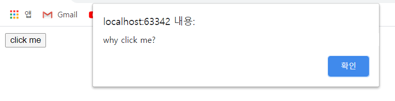
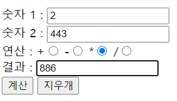
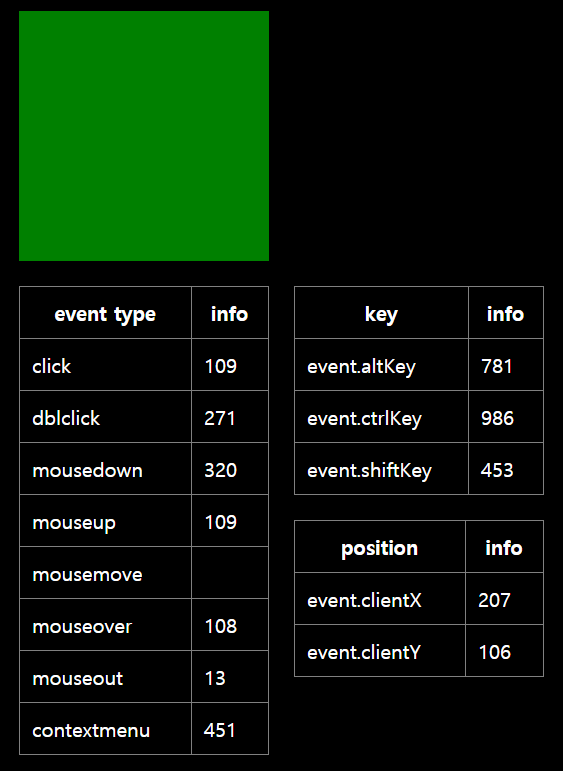
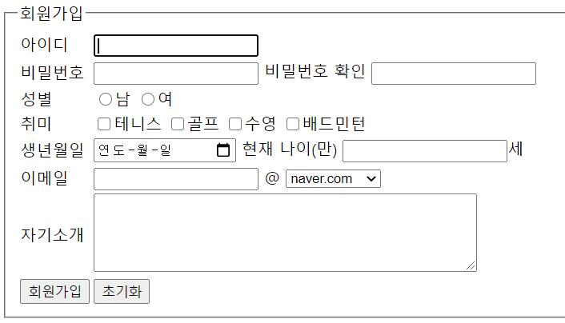

# Javascript

:객체 기반 클라이언트 스크립트 작성 언어. 생성된 객체를 이용하여 동적인 페이지를 기술한다. 확장자는 js

※`/* 주석은 // 여러 줄이면 별과 슬래시로 감싸기 */`


## 작성법

1. html 문서 내에 작성

   ```html
   <head>
   	<script type="text/javascript">
           여기에 작성
       </script>
   </head>
   ```

2. js파일로 작성하여 html 문서에 포함

   ```html
   <head>
   	<script type="text/javascript" src="test.js">
         	test.js파일 불러옴
       </script>
   </head>
   ```

3. 함수 정의: function (파이썬 def)

   ```javascript
   function myfunc(){
   	return 3;
   }
   ret=myfunc(); //함수 호출
   document.write(ret);
   ```

4. 변수 선언

   ```javascript
   var로 선언. 브라우저가 알아서 type 분류.
   
   var a=10;
   var b='k';
   document.write(a); //print임
   
   type확인
   document.write(typeof '스크립트');
   document.write(typeof 1);
   ```

5. 자료 유형

   ```
   Boolean:참/거짓
   String:문자열
   Number:숫자형
   null:빈 값
   NaN:Not a Number, 숫자 아님
   Infinity:무한대
   ```

6. 차이점

   ```javascript
   html태그 사용가능.
   document.write('b는'+'<br>'+'bee'+'<br>');
           
   \n은 띄어쓰기
   document.write('b는\nbee');
   ```

7. True 값은 1

   ```javascript
   그 외는 False
   document.write(true==1); //True
   document.write(true=='1'); //True
   document.write(true==0); //False
   document.write('one'==1); //False
   document.write(true==2); //False
   document.write('one'!==1); //True
   
   document.write(1>2); //False
   ```

8. style 바꾸기

   ```javascript
   '<태그>'+'</태그>'로 감싸준다
   
   for(var i=0;i<100;i++){
       for(var j=0;j<10;j++){
           document.write('<font color="blue">'+String(i)+String(j)+"<br/>"+'</font>');
           }
       }
   
   ```

   

9. on 이벤트 속성명

   : 이벤트가 발생하게 하는 속성명은 on으로 시작하는 함수

   ```html
   <input type="button" value="click me" onclick="alert('why click me?')">
   ```

   


### 조건문

* if 조건문

```javascript
if(조건){
수행할 문장;
}
else if(조건){
}
```

```javascript
if(2>1){
alert("2가 1보다 큽니다");
}

if(false){
alert("1");
}
else if{
alert('참');    
}
alert("3"); //조건문과 별개로 동작


아이디 넣기
id=prompt("아이디:")
if(id=='master'){
alert("아이디가 일치합니다");
document.write(id+'<br/>');
}
else{
alert("아이디가 일치하지 않습니다");
}

아이디 맞으면 비번 넣기
id=prompt("아이디:")
if(id=='master'){
alert("아이디가 일치합니다");
document.write(id+'<br/>');
pw=prompt("비밀번호:");
if(pw=='1234'){
alert("인증에 성공하였습니다");
}
else{
alert("인증에 실패하였습니다");
}}
else{
alert("아이디가 존재하지 않습니다");
}
```

### 반복문

* while 문

```javascript
주로 무한반복할 때
while(조건){
반복할 문장;
}
```

```javascript
var i=0;
while(i<10){
document.write("무한 코딩");
i++; //i+=1
}
```

* for 문

```javascript
break 하고 continue 다 들어가 있음

var i=0;
for(i=0;i<10;i++){
document.write("무한 코딩<br/>");
}

5빼고 출력:
var i=0;
for(i=0;i<10;i++){
if(i==5){
continue;}
document.write(i+"무한 코딩<br/>");
}

3의배수 출력:
for(i=1;i<101;i++){
if(i%3==0){
document.write(i+'<br/>');
}}

앞자리를 문자로 바꿔서 00부터 99까지 표현(하나만 문자여도 다 문자로 변환해서 더한다)
for(var i=0;i<10;i++){
    for(var j=0;j<10;j++){
        document.write(String(i)+j+"<br/>");
        }
    }

function numbering(){
for(var i=0;i<5;i++){
    j=0;
    while(j<10){
    document.write(j);
    j++;}
    document.write('<br>');}
    }
numbering();
```

* 연습

```html
구구단
function gugu(){
    for(var i=1;i<10;i++){
        for(var j=1;j<10;j++){
        document.write(i*j+'\n');
        }
    document.write("<br/>");
    }
}
gugu();

function gugu(){
    var i=1;
    while(i<10){
        var j=1;
        while(j<10){
        document.write(i*j+'\n');
        j++;
        }
    i++;
    document.write("<br/>");
    }
}
gugu();

최대최소 구하기
var arr=[52,273,103,32,57,103,31,2];
function Max(){
    var max=arr[0];
    for(var a=1;a<arr.length;a++){
        if(max<arr[a]){
            max=arr[a];
            }
        }
    return max;
}
document.write(Max()+"<br/>");

function Min(){
    return Math.min.apply(null,arr);
    }
document.write(Min());

다이아몬드 그리기
for(var i=1;i<=5;i++){
    for(var j=5;j>i;j--){
        document.write('&nbsp;');
    }
    for(var k=0;k<i*2-1;k++){
        document.write('*');
    }
    document.write('<br>');
}
for(var i=4;i>0;i--){
    for(var j=4;j>=i;j--){
        document.write('&nbsp;');
    }
    for(var k=0;k<i*2-1;k++){
        document.write('*');
    }
    document.write('<br>');
}

                              
2)
for(var i=1;i<11;i++){
    for(var k=1; k<(11-i)/2;k++){  //공백 4,3,2,1
        document.write('&nbsp');
        }
    for(var j=1;j<i+1;j++){    // * 1,3,5,7
        document.write("*");
        }
    document.write("<br/>")
    i++;
}

    for(var i=1;i<9;i++){
   	 for(var k=1;k<=(i+1)/2;k++){   //공백 1,2,3,4
     document.write('&nbsp');
       }
     for (var j=1;j<9-i;j++){  // * 7,5,3,1
        document.write("*");
        }
      document.write("<br/>")
      i++;
 }

```


## 함수

```javascript
function 함수이름(인수들){
코드1;
if(조건)return;
코드2;
코드3;
return 반환값

function myf(a,b){
return a+b;}
alert(myf(10,5));

/*
var myf=function (a1,a2){
document.write(a1+a2){
}
myf(10,20)
안되는데? */
```

* 함수 호출하는 다양한 방법

```javascript
1)body에서 호출
<head>
<script> 
function mycalc(){
alert("호출");
}
</script>
</head>
<body onload="mycalc()">
//body가 load될때 mycalc함수 호출됨
    
2)
<script>
window.onload=function(){
alert("윈도우 객체의 onload 함수에 대해 정의 on함수는 콜백함수. 윈도우가 load되면 함수호출");
}
</script>
//윈도우 load될때 자동으로 함수 호출
```


* `parseInt()`

:문자로 된 숫자를 숫자로 변환

```javascript
var k='5';
document.write(k+2) //문자+숫자는 문자 결합 52
document.write(parseInt(k)+2); //숫자로 인식해서 7
document.write(parseInt('hello'); //NaN
```

* `alert()`

:창 뜰때 메세지로 내용 출력

```javascript
연산 사용 가능
alert('Hello World');
alert(2*4);
alert("안녕\n하세요"); //줄바꿈
alert("안녕".length); //문자열 길이
alert("1"==1); //내부적으로 연산을 하기 전에 자동 형 변환 True
alert("1"===1); //형 변환 안됨 False
```

* `Math 클래스`

```javascript
Math.pow(3,4) //지수 81
Math.sqrt(4) //루트 2
Math.round() 반올림
Math.ceil() 올림
Math.floor() 내림
Math.random() 난수
```

* `Date 클래스`

```javascript
document.write(new Date()); //데이트 클래스에서 새 객체를 만든다

date에서 원하는 정보만 가져오기
var date1=new Date();
alert(date1.getFullYear()); //연도 추출
date1.getMonth()+1; //0부터 시작
date1.getDate();
date1.getDay(); //요일(0:일,...6:토)
```

* 문자열 추출

```javascript
var s="hello world";
document.write(s.charAt(1)+"<br>"); //인덱스는 0부터
document.write(s.substring(1,5)); //1~4 인덱스 참조


```


#### 버튼

:`<body>` 내용 버튼으로 조작하기

```html
<body>

<h1><a href="index.html">WEB</a></h1>
<h2 style="background-color:coral; color:skyblue; width=300;">JavaScript</h2>
그냥 글자<br>
<input type="button" value="black" onclick="
document.querySelector('body').style.backgroundColor='black';
document.querySelector('body').style.color='white';
">
<input type="button" value="white" onclick="
document.querySelector('body').style.backgroundColor='white';
document.querySelector('body').style.color='black';
">

<!--toggle 눌렀을 때, 화이트면 블랙으로, 블랙이면 그대로-->
<input id="mywhite" type="button" value="toggle" onclick="
if(document.querySelector('#mywhite').value=='white'){
document.querySelector('#myblack').value='black';
document.querySelector('body').style.backgroundColor='white';
document.querySelector('body').style.color='white';
}else{
document.querySelector('body').style.backgroundColor='black';
document.querySelector('body').style.color='white';}
">
<!--버튼 눌렀을 때 블랙이면 화이트로, 화이트면 블랙으로-->
<input type="button" value="black" onclick="
var target=document.querySelector('body');
if(this.value=='black'){
target.style.backgroundColor='black';
target.style.color='white';
this.value='white';
}else{
target.style.backgroundColor='white';
target.style.color='black';
this.value='black';
}
">
</body>

```

```html
전달할때는 this, 받을 때는 self

<html>
    <head>
        <title>WEB1 - JavaScript</title>
        <meta charset="utf-8">
        <script>

            function nightDayHandler(self){

            var target = document.querySelector('body');
            if(self.value === 'night') {
                target.style.backgroundColor = 'black';
                target.style.color = 'white';
                self.value = 'day';

                var alist = document.querySelectorAll('a');
                var i = 0;
                while(i < alist.length) {
                    alist[i].style.color = 'powderblue';
                    i = i + 1;
                }
            } else {
                target.style.backgroundColor = 'white';
                target.style.color = 'black';
                self.value = 'night';

                var alist = document.querySelectorAll('a');
                var i = 0;
                while(i < alist.length) {
                    alist[i].style.color = 'blue';
                    i = i + 1;
                }
            }
            }
        </script>
    </head>
<body>
        <h1><a href="index.html">WEB</a></h1>

        <input type="button" value="night" onclick="nightDayHandler(this);">

        <ol>
            <li><a href="1.html">HTML</a></li>
            <li><a href="2.html">CSS</a></li>
            <li><a href="3.html">JavaScript</a></li>
        </ol>
        <h2>JavaScript란 무엇인가?</h2>
        <p>JavaScript (/ˈdʒɑːvəˌskrɪpt/),[6] often abbreviated as JS, is a high-level, interpreted programming language. It is a language which is also characterized as dynamic, weakly typed, prototype-based and multi-paradigm. Alongside HTML and CSS, JavaScript is one of the three core technologies of the World Wide Web.[7] JavaScript enables interactive web pages and thus is an essential part of web applications. The vast majority of websites use it,[8] and all major web browsers have a dedicated JavaScript engine to execute it.</p>

        <input type="button" value="day" onclick="nightDayHandler(this);">
    </body>
</html>
```


## 배열

:값 여러개 저장

```javascript
배열을 선언하는 여러가지 방법

var n=['kim','lee',100,'park'];
var myarr1=[];
var odd=[1,3,5,7];
var even=new Array(2,4,6,8); //even=[2,4,6,8]
var mixarr=['a',1,3,new Date(), "today"];
document.write(odd[2]);

function f(){
    return['aaa','bbb'];
    }
var m=f()
document.write(m[0]);


배열 정보
document.write(arr.index0f(3)); //3이라는 자료의 인덱스 출력(0부터 시작) 없으면 -1

```

* 배열 편집

```javascript
배열 추가
var arr=[1,2,3,4];

arr.push(5); //끝에 5 추가
arr.unshift(999); //앞에 999 추가

배열 삭제
var arr=[1,2,3,4];
arr.pop(); //끝값 꺼내고 그 값을 리턴
arr.shift(); //첫값 꺼내고 그 값을 리턴
arr.splice(1,2); //(시작인덱스, 제거항목개수)를 꺼내고 그 값을 리턴

배열 정렬
var fruits=['banana','apple','orange'];
fruits.sort(); //오름차순 정렬
fruits.reverse(); //반대로 정렬(sort 먼저 해주면 내림차순)
```

* 

```javascript

```


## 객체

<i>클래스(도면)는 실(객)체(건물)가 없다. 클래스 안에 객체들=속성+메서드 가짐</i> 

순서 없다


### 속성

: {속성:속성값, 속성:속성값,...} (파이썬의 딕셔너리{키:값, 키:값, ...}와 비슷)

* 작성

```javascript
1)
var hgd={};
hgd['name']='honggildong';
hgd['age']=28;
hgd['gender']='m';
document.write(hgd['name']);

2)
var hgd={
'name':'honggildong',
'age':28,
'gender':'m',
}
document.write(hgd['name']);

3)new 클래스명
var hgd=new Object();
hgd['name']='honggildong';
hgd['age']=28;
hgd['gender']='m';
document.write(hgd['name']+"<br/>");
document.write(hgd.name+"<br/>");

for(k in hgd){
document.write(k+"<br/>"); //속성 출력
}
for(k in hgd){
document.write(hgd[k]+"<br/>"); //속성값 출력
}
for(var k in coworkers){
    document.write(k+":"+coworkers[k]+"<br>");
}
```

* 편집

```html
추가
hgd.birth=1994; //접근할 때 . 사용
document.write(hgd['birth']);
속성에 공백있으면 []
hgd.['data science']='taeho';

```

### 동작

```html
객체에 소속된 함수는 "메서드"
객체에 소속된 변수는 "프로퍼티"
```

* 작성

```javascript
var hgd={
'list':{
'name':'honggildong',
'age':28,
'gender':'m'},    //속성 정의

1)
'show':function(){  //this:현재의 객체(hgd),파이썬 self
    for(var n in this.list){
        document.write(n+":"+this.list[n]+"<br/>");
        }
    } //메서드 정의
};
hgd.show();

2)
hgd.showAll=function(){
    for(var k in this){ //k가 키값
        document.write(k+':'+this[k]+'<br>')
    }
}
hgd.showAll();
/*
name:honggildong
age:28
gender:m
*/

```

```javascript

```


#### 정규식

```javascript
var re=/ab+c/; //슬래시로 감싸기
var re=RegExp("ab+c"); //RegExp 객체 생성 방법
```

* 메소드

| 속성    | 설명                                                         |
| ------- | ------------------------------------------------------------ |
| exec    | 대응되는 문자열을 찾는 메소드. 정보를 가지고 있는 배열을 반환하고 못찾으면 null |
| test    | 대응되는 문자열이 있는지 검사하는 메소드.  true/false 반환   |
| match   | 대응되는 문자열을 찾는 메소드. 정보를 가지고 있는 배열을 반환하고 못찾으면 null |
| search  | 대응되는 문자열이 있는지 검사하는 string메소드. 대응된 부분의 인덱스를 반환하고 못찾으면 -1 |
| replace | 대응되는 문자열을 다른 문자열로 치환하는 string 메소드       |
| split   | 정규식 혹은 문자열로 대상 문자열을 나누어 배열로 반환        |

```javascript
var myRe=/d(b+)d/g;
var myArray=myRe.exec('cdbbdvsvz');

var myArray=/d(b+)d/g.exec('cdbbdvsvz');

var myRe=new RegExp("d(b+)d", "g");
var myArray=myRe.exec("cdbbdbsbz");
```

**다 같은 결과**지만 정규식 객체를 변수에 대입해야 정규식의 속성에 접근할 수 있다. 

```javascript
var myRe = /d(b+)d/g;
var myArray = myRe.exec("cdbbdbsbz");
console.log("The value of lastIndex is " + myRe.lastIndex);

// "The value of lastIndex is 5"
```


* 괄호로 둘러싼 패턴 사용하기

```javascript
document.write(/(zoo) (bar)/.exec("zoo bar test")+'<br>');
document.write(/(zoo) (bar)/.exec("zoo test bar")+'<br>'); //매치 후 ()부분 대부적으로 기억
```

```javascript
var re = /(\w+)\s(\w+)/;
var str = "John Smith";
var newstr = str.replace(re, "$2, $1");
console.log(newstr);

// "Smith, John"
```

* 플래그를 사용한 고급검색

```javascript

```

### 연습

#### 계산기

```javascript
<!DOCTYPE html>
<html lang="en">
<head>
    <meta charset="UTF-8">
    <title>Day21 계산기</title>
    <script>
    /*window.onload=function(){
    document.getElementById("btnCalc").onclick=mycalc;
    }*/

function mycalc(){
    if(frm.num1.value===""){
        alert("숫자 1에 값을 입력하세요");
        frm.num1.focus();
        return;
        }
        //숫자, 음수기호, 소수점만 입력 가능하도록 정규식 정의
        var regEx1=/^-?\d*\.?\d*$/;
        if(!frm.num1.value.match(regEx1)){
            alert("숫자만 입력하세요");
            frm.num1.value="";
            frm.num1.focus();
            return;
            }
        else if(frm.num1.value==="0"){
            alert("숫자1에 0값이 있습니다");
            frm.num1.value="";
            frm.num1.focus();
            return;
            }

    if(frm.num2.value===""){
        alert("숫자 2에 값을 입력하세요");
        frm.num2.focus();
        return;
        }
        var regEx2=/^-?\d*\.?\d*$/;
        if(!frm.num2.value.match(regEx2)){
            alert("숫자만 입력하세요");
            frm.num2.value="";
            frm.num2.focus();
            return;
            }
        else if(frm.num2.value==="0"){
            alert("0은 입력 불가");
            frm.num2.value="";
            frm.num2.focus();
            return;
            }

        //선택된 라디오 버튼 가져와서 연산. 안됐으면 선택해라 alert
        isCalcChecked=false;
        for(var i=0;i<frm.calc.length;i++){
            if(frm.calc[i].checked){
                oper=frm.calc[i].id;
                isCalcChecked=true;
                }
            }
        if(!isCalcChecked){
            alert("연산자를 선택하세요");
            return;
            }

        //연산
        var su1=frm.num1.value;
        var su2=frm.num2.value;
        if(oper==="add"){
            document.getElementById("res").value=eval(su1+"+"+su2);
            }
        else if(oper==="sub"){
            if(frm.num2.value[0]=="-"){
                document.getElementById("res").value=eval(su1+"+"+(-su2));
                }
            else{document.getElementById("res").value=eval(su1+"-"+su2);
                }
            }
        else if(oper==="mul"){
            document.getElementById("res").value=eval(su1+"*"+su2);
            }
        else{
            document.getElementById("res").value=eval(su1+"/"+su2);
            }


}

    </script>
</head>
<body>
<form name="frm">

<label>숫자 1 : <input type="text" id="num1"></label><br>
<label>숫자 2 : <input type="text" id="num2"></label><br>

<label>연산 :
<label for="add">+<input type="radio" name="calc" id="add"></label>
<label for="sub">-<input type="radio" name="calc" id="sub"></label>
<label for="mul">*<input type="radio" name="calc" id="mul"></label>
<label for="div">/<input type="radio" name="calc" id="div"></label></label><br>

<label>결과 : <input type="text" id="res" readonly="readonly"></label><br>
<input type="button" value="계산" id="btnCalc" onclick="mycalc()">
<input type="reset" value="지우개">

</form>
</body>
</html>
```




#### 마우스 이벤트 정보 출력

```javascript
<!DOCTYPE html>
<html lang="en">
<head>
    <meta charset="UTF-8">
    <title>day22</title>

    <!--녹색 박스 안에서 발생하는 마우스 이벤트 정보 출력하기-->
    <style>
            body{
                background-color: black;
                color:white;
            }
            #target{
                width:200px;
                height:200px;
                background-color: green;
                margin:10px;
            }
            table{
                border-collapse: collapse;
                margin:10px;
                float: left;
                width:200px;
            }
            td, th{
                padding:10px;
                border:1px solid gray;
            }
        </style>

</head>


<body>

<div id="target"></div>
<table>
    <tr>
        <th>event type</th>
        <th>info</th>
    </tr>
    <tr>
        <td>click</td>
        <td id="elmclick"></td>
    </tr>
    <tr>
        <td>dblclick</td>
        <td id="elmdblclick"></td>
    </tr>
    <tr>
        <td>mousedown</td>
        <td id="elmmousedown"></td>
    </tr>
    <tr>
        <td>mouseup</td>
        <td id="elmmouseup"></td>
    </tr>
    <tr>
        <td>mousemove</td>
        <td id="emlmousemove"></td>
    </tr>
    <tr>
        <td>mouseover</td>
        <td id="elmmouseover"></td>
    </tr>
    <tr>
        <td>mouseout</td>
        <td id="elmmouseout"></td>
    </tr>
    <tr>
        <td>contextmenu</td>
        <td id="elmcontextmenu"></td>
    </tr>
</table>
<table>
    <tr>
        <th>key</th>
        <th>info</th>
    </tr>
    <tr>
        <td>event.altKey</td>
        <td id="elmaltkey"></td>
    </tr>
    <tr>
        <td>event.ctrlKey</td>
        <td id="elmctrlkey"></td>
    </tr>
    <tr>
        <td>event.shiftKey</td>
        <td id="elmshiftkey"></td>
    </tr>
</table>
<table>
    <tr>
        <th>position</th>
        <th>info</th>
    </tr>
    <tr>
        <td>event.clientX</td>
        <td id="elmclientx"></td>
    </tr>
    <tr>
        <td>event.clientY</td>
        <td id="elmclienty"></td>
    </tr>
</table>
<script>
var t=document.getElementById('target');

function handler(event){
//alert(event.type);
var time=new Date(); //date객체 생성
var timestr=time.getMilliseconds();
var info=document.getElementById("elm"+event.type);
info.innerHTML=timestr; //html내에 info 아이디에 직접 쓰기

if(event.altKey){
document.getElementById("elmaltkey").innerHTML=timestr}
if(event.ctrlKey){
document.getElementById("elmctrlkey").innerHTML=timestr}
if(event.shiftKey){
document.getElementById("elmshiftkey").innerHTML=timestr}

//가로세로 좌표
//브라우저 전체 기준
document.getElementById("elmclientx").innerHTML=event.clientX;
document.getElementById("elmclienty").innerHTML=event.clientY;

//그린박스 영역 기준
//document.getElementById("elmclientx").innerHTML=event.offsetX;
//document.getElementById("elmclienty").innerHTML=event.offsetY;
}

t.addEventListener("click",handler);
t.addEventListener("dblclick",handler);
t.addEventListener("mousedown",handler);
t.addEventListener("mouseup",handler);
//t.addEventListener("mousemove",handler)
t.addEventListener("mouseover",handler);
t.addEventListener("mouseout",handler);
t.addEventListener("contextmenu",handler);

//add로 눈코귀달아주고 event는 외부입력 Listener:입력을 인식하는("이벤트종류",반응)
//event 변수 안에는 type(종류), 위치 등 모든 정보 다들어있음
</script>

</body>
</html>
```



#### 회원가입창

```javascript
<!DOCTYPE html>
<html lang="en">
<head>
    <meta charset="UTF-8">
    <title>회원가입</title>
    <script>
window.onload=function(){
frm.id.focus();
return;
}

function myvalid(){
    var regExid=/^[a-z][a-z0-9]{5,11}$/;
    if(!frm.id.value.match(regExid)){
        alert("id는 6글자 이상 12글자 이하의 숫자와 소문자 조합, 반드시 문자로 시작");
        frm.id.focus();
        return;
        }
    if(frm.pw1.value!=frm.pw2.value){
        alert("비밀번호가 일치하지 않습니다");
        return;
        }
    var selectedHobby=document.querySelectorAll('input[name="hobby"]:checked');
    var hobbyCnt=selectedHobby.length;
    if(hobbyCnt==4){
        alert("취미는 3개 이하로 선택하세요");
        selectedHobby.forEach(function(v,i){v.checked=false;});
        return;
        }
    var regExemail=/^[a-zA-Z0-9]{1,12}$/;
    if(!frm.email.value.match(regExemail)){
        alert("이메일 아이디는 특수문자 없이 12글자 이내로 작성하세요");
        frm.email.focus();
        return;
        }
    if(document.getElementById('memo').value.length<10){
        alert("자기소개는 10글자 이상 입력하세요");
        return;
        }
}

function myage(){
    var today=new Date();
    var yearNow=today.getFullYear();
    var birth=new Date(document.getElementById('birth').value);
    var birthYear=birth.getFullYear();
    document.getElementById('age').value=yearNow-birthYear;
    return;
    }

    </script>
</head>
<body>
<form name="frm">
    <fieldset>
        <legend>회원가입</legend>
        <table>
            <tr>
                <td>아이디</td>
                <td><input type="text" id="id" name="id"></td>
            </tr>
            <tr>
                <td>비밀번호</td>
                <td><input type="password" id="pw1" name="pw1">
                비밀번호 확인
                <input type="password" id="pw2" name="pw2">
                </td>
            </tr>
            <tr>
                <td>성별</td>
                <td><input type="radio" name="gender" id="male">남
                    <input type="radio" name="gender" id="female">여
                </td>
            </tr>
            <tr>
                <td>취미</td>
                <td><input type="checkbox" name="hobby" value="tennis">테니스
                    <input type="checkbox" name="hobby" value="golf">골프
                    <input type="checkbox" name="hobby" value="swim">수영
                    <input type="checkbox" name="hobby" value="bad">배드민턴
                </td>
            </tr>
            <tr>
                <td>생년월일</td>
                <td><input type="date" name="birth" id="birth">
                    현재 나이(만)
                    <input type="text" name="age" id="age" onfocus="myage()" readonly="readonly">세</td>
                </td>
            </tr>
            <tr>
                <td>이메일</td>
                <td><input type="text" name="email" id=email">
                    @
                    <select id="url">
                        <option value="naver" selected>naver.com</option>
                        <option value="gmail">gmail.com</option>
                        <option value="daum">daum.net</option>
                        <option value="hotmail">hotmail.com</option>
                    </select>
                </td>
            </tr>
            <tr>
                <td>자기소개</td>
                <td><textarea id="memo" rows="5" cols="50"></textarea></td>
            </tr>
            <tr>
                <td>
                <input type="button" value="회원가입" id="signup" onclick="myvalid()"></td>
                <td>
                <input type="reset" value="초기화" id="reset"></td>

            </tr>
        </table>

    </fieldset>

</form>
</body>
</html>
```



