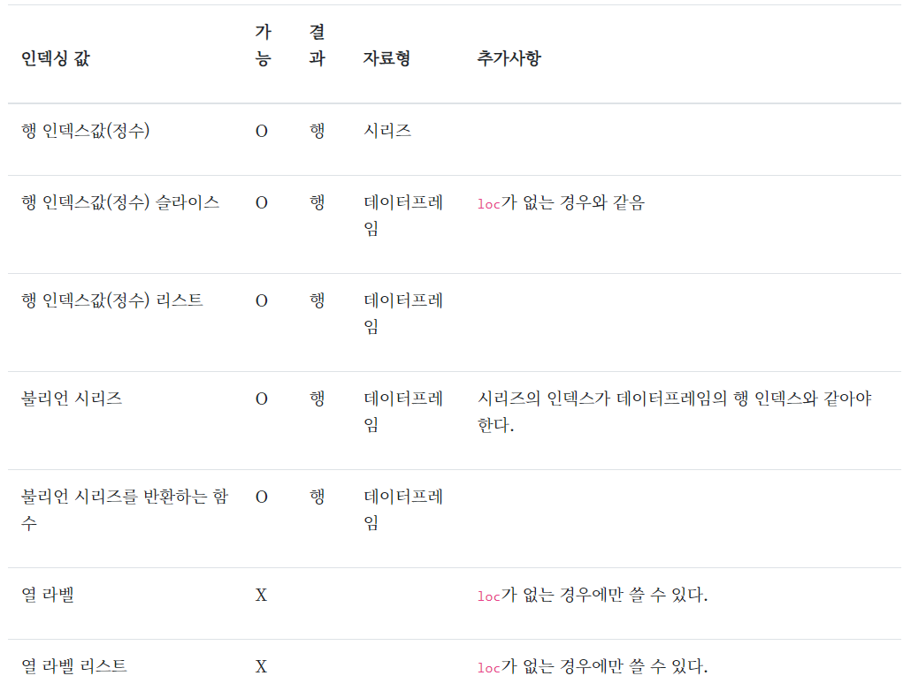
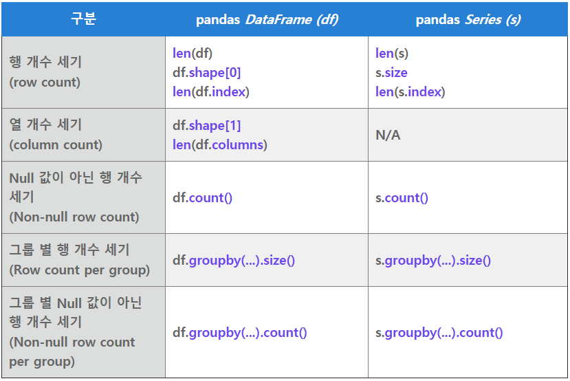

# Numpy

> 빠르고 공간 효율적인 ndarray 로 벡터 연산이 가능한 다차원 배열 생성가능. loop 프로그래밍 없이 전체 배열에 대해 표준 수학 함수를 빠른 속도로 수행할 수 있어 선형대수, 무작위 난수 생성 등에 많이 사용.

```python
import numpy as np
```

버전 확인 : `np.__version__`

걸리는 시간 확인(매직 타임) : `%time`

```python
li=list(range(10))
%time for _ in range(10): li2=[x*2 for x in li]

myarr=np.array([1,2,3])
%time for _ in range(10): arr2=myarr*2
```

numpy는 array에 바로 곱하면 요소에 곱해진다


## array


### 생성

```python
직접 넣기
np.array([6,5,4,3])
np.array([[1,2,3],[4,5,6]])

data=[1,2,3]
arr1=np.array(data, dtype=np.float32)
```

```python
np.arange(from,to,step) #to 포함 안함

np.arange(5) #0~4까지 array
np.arange(1,6,2) #array([1, 3, 5])
```

```python
# 행렬구조로 변환하기
np.reshape(행,열)

arr=np.arange(4)
arr.reshape(2,2)
#array([[0, 1],
#       [2, 3]])

np.arange(6).reshape(2,3)
#array([[0, 1, 2],
#       [3, 4, 5]])

#행렬구조 -> 일차원으로 펼치기
arr.flatten()
arr.ravel()

x=np.arange(5)
x[:,np.newaxis] #각 행을 하나의 열로
```

```python
np.asfarray() #float형태로 만들 때
d=[1,2,3]
np.asfarray(d)
array([6.,7.,8.,9.,10.])

np.asarray()로 array로 변환
#단, 이미 있다면 복사 안함
a=np.asarray(arr)
a is arr
#True

np.asarray_chkfinite() #데이터의 결측값이나 무한수 있으면 에러
```


#### 요소 채우기

```python
#0으로 채우기(실수 형태)
np.zeros(10) 
np.zeros((3,6)) 

#1로 채우기
np.ones((2,3))
np.ones(5)*5

#(2,2)행렬을 5로 초기화
np.full((2,2),5) 
#array([[5, 5],
#       [5, 5]])

#단위행렬
np.eye(3)
#array([[1., 0., 0.],
#       [0., 1., 0.],
#       [0., 0., 1.]])
np.eye(3,k=1)
#array([[0., 1., 0.],
#       [0., 0., 1.],
#       [0., 0., 0.]])
np.eye(3,k=-1)
#array([[0., 0., 0.],
#       [1., 0., 0.],
#       [0., 1., 0.]])

#난수(쓰레기값) 채우기
np.empty(3)
np.empty((3,2))
```

- 이미 있는 array와 동일한 모양과 데이터형태를 유지한 상태에서 초기화

```python
a=np.array([[1,2,3],[4,5,6]])

np.zeros_like(a)
array([[0, 0, 0],
       [0, 0, 0]])

np.ones_like(a)
array([[1, 1, 1],
       [1, 1, 1]])

np.empty_like(a)
array([[-1856051296,         340,           0],
       [          0,           1,           0]])
```


#### 난수 발생

```python
np.random.seed(0) #시드 생성

행렬구조로 난수 발생시킬때 함수에 따라 인자를 튜플로 받기도 한다.
-> (()) 와 ()를 다르게 줘야한다.

#[0,1)범위 내 균일 분포
np.random.rand(5)
np.random.rand(2,3)

#평균이 0 표준편차가 1인 표쥰정규분포를 따르는 난수
np.random.randn(5)
np.random.randn(2,3)

np.random.standard_normal(3)
np.random.standard_normal((2,3))

#0에서 1사이의 난수. 
np.random.random(2)
np.random.random((2,3)) 

#정수 난수
np.random.randint(5,size=3) #[0,5)에서 정수 3개
np.random.randint(1,4,2) #[1,4)에서 정수 2개
np.random.randint(1,5,size=(2,3)) #[1,5)에서 (2,3) 행렬구조

#주어진 1차원 어레이에서 샘플 생성
np.random.choice(5,3) #np.arange(5)에서 3개 샘플
np.random.choice(10,(2,3)) #np.arange(10)에서 (2,3) 어레이

#정규 분포로부터 샘플링된 난수
np.random.normal(0,1,2) #정규분포 N(0,1)의 임의의 숫자 2개
np.random.normal(1.5,2.0,(2,3)) #정규분포 N(1.5,2.0^2)의 (2,3)형태의 임의의 숫자 어레이

x=np.arange(10)
np.random.shuffle(x)
x
```


### 속성

numpy 배열은 모든 원소가 같은 자료형이어야 한다.

```python
arr=np.ones((2,3))

len(arr) #행의 개수
len(arr[0]) #열의 개수
np.shape(arr)[1]
arr.shape #(2,3)
arr.ndim #2차원
arr.dtype #dtype('float64')
#type 변환은 arr.astype(np.float64) => 실수로 변환
arr.itemsize #8 (8byte=float, 4byte=int)
arr.size #6 (요소개수)

arr.T  #행,열 바꾸기
```

```python
#3차원 배열
#0~31까지의 array
arr=np.arange(32).reshape(4,2,4) #4행 2열 4채널=깊이=높이

array([[[ 0,  1,  2,  3],
        [ 4,  5,  6,  7]],

       [[ 8,  9, 10, 11],
        [12, 13, 14, 15]],

       [[16, 17, 18, 19],
        [20, 21, 22, 23]],

       [[24, 25, 26, 27],
        [28, 29, 30, 31]]])

arr.ndim #3차원
arr.sum() #전체합

arr.sum(axis=0) #행 방향으로 요소 모두 더한 값
array([[48, 52, 56, 60],
       [64, 68, 72, 76]])

arr.sum(axis=1) #열 방향으로 요소 모두 더한 값
array([[ 4,  6,  8, 10],
       [20, 22, 24, 26],
       [36, 38, 40, 42],
       [52, 54, 56, 58]])

arr.sum(axis=2) #깊이 방향으로 요소 모두 더한 값
array([[  6,  22],
       [ 38,  54],
       [ 70,  86],
       [102, 118]])
```


#### 기술통계

```python
#axis 생략하면 None
arr.sum(axis=None) #np.sum(arr)
arr.min() #np.min(arr)
arr.mean() #np.mean(arr)
arr.var() #np.var(arr)
arr.std() #np.std(arr)
arr.median() #np.median(arr)
arr.cumsum() #누적합
arr.cumprod() #누적곱
np.percentile(arr,25) #0=최소, 25=1사분위수...

arr>0.sum() #양수의 개수
arr[arr>0].sum() #양수의 합
```

#### 결합

```python
#열 결합 (행의 개수가 같아야한다)
a=np.ones((2,3))
b=np.zeros((2,2))
np.hstack([a,b])

#행 결합 (열의 개수가 같아야한다)
a=np.ones((2,4))
b=np.zeros((3,4))
np.vstack([a,b])

#배열 반복
np.tile(a,2) #옆으로 2번 
np.tile(a,(3,1)) #아래로 3번
np.tile(a,(3,2)) #아래로 3번, 옆으로 2번
```


### 연산

```python
array 요소별 연산

data=np.arange(6)

data*10
data+data
data*data
data**2 
np.dot(data,data.T) #행렬곱 (2,3)*(3,2)=>(2,2)
np.sqrt(data)
np.exp(data)
np.maximum(x,y) #x,y 배열의 두 요소 중 큰 값 리턴
np.minimum(x,y) #x,y 배열의 두 요소 중 작은 값 리턴
np.modf(arr) #정수, 실수 분리해서 array 두 개인 튜플로 리턴
remainder, whole_part=np.modf(arr) #각 array를 변수에 넣기
np.meshgrid() #두 개의 1차원 배열을 입력받아서 가능한 모든 (x,y) 2차원 배열 2개 리턴
```


### 인덱싱

:특정 데이터만 추출하는 작업

```python
0번부터 인덱싱

ar2=np.arange(10,16).reshape(2,3)
#array([[10, 11, 12],
#       [13, 14, 15]])

#12 인덱싱
ar2[0][2] 
ar2[0,2]
ar2[0][-1]

#1행 2열 
ar2[1,2] 

#0행과 1행
ar2[[0,1]]

arr=np.arange(10,42).reshape(8,4)
#1,5,7,2 행 추출
arr[[1,5,7,2]] 

#각 행의 추출할 열 값 따로 입력하여 하나의 벡터값으로 추출
arr[[1,5,7,2],[0,3,1,2]] 
#array([14, 33, 39, 20])

#각 행의 추출할 열 순서 정하기
arr[[1,5,7,2]][:,[0,3,1,2]] 
```

#### 인덱스 구하기

```python
#0이 아닌 인덱스
np.nonzero([1,2,0,0,3])
#(array([0, 1, 4], dtype=int64),)

#오름차순으로 인덱스 반환
np.argsort(기준)
#내림차순은 -
np.argsort(-기준)
```

#### 슬라이싱

```python
arr=np.arange(11,20).reshape(3,3)
arr
array([[11, 12, 13],
       [14, 15, 16],
       [17, 18, 19]])

arr[:2,1:]
array([[12, 13],
       [15, 16]])

arr[2] #1차원 (3,)
arr[2,:] #1차원 (3,)
arr[2:,:] #2차원 (1,3)
#다 같은 결과인데 구조가 다름
array([17, 18, 19])
-범위에 따라 구조가 달라진다. 
-[1,]은 1차원, [1:2,]은 2차원

arr[::-1] #역방향
array([[17, 18, 19],
       [14, 15, 16],
       [11, 12, 13]])
```

#### 불리안 참조

```python
names=np.array(['Bob','Mary','Joe','Bob','Will'])

names=='Bob'
#array([ True, False, False,  True, False])

~(names=='Bob')
#array([False,  True,  True, False,  True])

#조건 여러개면 괄호
(names=='Bob')|(names=='Will') 
#array([ True, False, False,  True,  True])

arr=np.array([6,3,2,5,6,4,4])
np.in1d(arr,[2,3,6]) #arr의 요소가 [2,3,6]중에 포함되어 있는지
```

### 정렬

```python
 #열 방향으로 오름차순 정렬
arr.sort()
arr

#행 방향으로 오름차순 정렬
arr.sort(axis=0) 
arr

#내림차순
arr.sort()
arr[::-1] 

#문자형, 범주형 정렬
names=np.array(['Bob','Mary','Joe','Bob','Joe'])
np.unique(names)
sorted(set(names)) #종류별로 정렬
```

```
idx,cnt=np.unique([1,3,5,6,3],return_counts=True) #각 개수도 세줌
#다른 방법 : 주사위를 던져서 나온 수 집합
np.bincount([1,1,3,3,5], minlength=7) #0~6까지 숫자들이 나온 횟수 세준다
```

- iris 데이터 가져오기

```python
from sklearn.datasets import load_iris
iris=load_iris()
iris.data[0,:]
```


참고: 데이터사이언스 스쿨 판다스 자료 정리

https://datascienceschool.net/01%20python/04.01%20%ED%8C%90%EB%8B%A4%EC%8A%A4%20%ED%8C%A8%ED%82%A4%EC%A7%80%EC%9D%98%20%EC%86%8C%EA%B0%9C.html

# Pandas

```python
import pandas as pd
from pandas import Series, DataFrame
```


### 데이터 입출력

- 저장

```python
%%writefile sample1.csv
c1, c2, c3
1, 1.11, one
2, 2.22, two
3, 3.33, three

=> 내용을 sample1.csv로 저장

%%writefile sample3.txt
c1        c2        c3        c4
0.179181 -1.538472  1.347553  0.43381
1.024209  0.087307 -1.281997  0.49265
0.417899 -2.002308  0.255245 -1.10515

%%writefile sample4.txt
파일 제목: sample4.txt
데이터 포맷의 설명:
c1, c2, c3
1, 1.11, one
2, 2.22, two
3, 3.33, three


%%writefile sample5.csv
c1, c2, c3
1, 1.11, one
2, , two
누락, 3.33, three
#na값 지정해서 읽어오기
data=pd.read_csv('sample5.csv',na_values=['누락',' '])
#한 것을 다시 저장
data.to_csv('sample6.txt',sep='|',encoding='euc-kr')
!type sample6.txt
#저장내용 확인 가능

#저장하면서
data.to_csv('sample9.csv',index=False) #행 인덱스 제거
data.to_csv('sample9.csv',index=False, header=False) #열 인덱스 제거
```

- 읽어오기

```python
#특정 열을 행인덱스로 사용하기
pd.read_csv('sample1.csv',index_col='c1')

#공백문자로 분리된 txt 자료의 경우
pd.read_table('sample3.txt',sep='\s+') #\s는 공백문자

#필요없는 부분 잘라서 읽어오기
pd.read_csv('sample4.txt',skiprows=[0,1])

#url로 읽어오기
df=pd.read_csv('https://raw.githubusercontent.com/CSSEGISandData/COVID-19/master/csse_covid_19_data/csse_covid_19_time_series/time_series_covid19_confirmed_global.csv')

#\t으로 구분자 되어있는 파일.tsv
gap=pd.read_csv('pandas_data/gapminder.tsv',sep='\t')
gap
```


## Series

### 생성

```python
pd.Series(range(10,14))


#딕셔너리로 생성
sdata={'Seoul':1000, 'Incheon':200, 'Gwangju':100, 'Busan':300}

obj=pd.core.series.Series(sdata, index=['Seoul','Incheon','Gwangju','Suwon'])

#딕셔너리 자료형에서 제공하는 in 연산도 가능하고 items 메서드를 사용하면 for 루프를 통해 각 원소의 키(key)와 값(value)을 접근할 수도 있다
for k, v in s.items():
    print("%s = %d" % (k, v))


```

```python
삭제
del obj['Gwangju']
```

### 속성

```python
시리즈는 벡터이므로 연산 가능, 함수 적용 가능, 불리안 참조 가능
```

```python
pd.notnull() #불리언
pd.isnull(obj)
obj.isnull()
```

### 인덱싱

```python
obj=pd.Series([3,1,-5,2], index=['d','a','b','c'])
obj['b']
obj[0:3]
obj[['c','a']]
obj[obj>0]
'a' in obj #인덱스 라벨 중에 a 있는가 => True
obj['a' in obj] #몇번 인덱스인지
```


## DataFrame

### 생성

```python
열 이름은 columns, 행 이름은 index로 지정

np.random.seed(1)
df=pd.DataFrame(np.random.randint(20,size=(5,6)),
            columns=['c1','c2','c3','c4','c5','c6'],
            index=['하나','둘','셋','넷','다섯'])
#또는 나중에 지정
#df.index=[]
#df.columns=[]

#열방향/행방향 인덱스에 이름 붙이기
df.index.name = "도시"
df.columns.name = "특성"
```


### 속성

```python
gap=pd.read_csv('pandas_data/gapminder.tsv',sep='\t')

np.ndim(gap)
np.shape(gap)
gap.size
gap.index
gap.columns
type(gap)
gap.dtypes
gap.info() 
```


### 인덱싱

```python
df['c2'] #c2열 시리즈 형태
df[['c2']] #c2열 데이터프레임 형태
df[['c1','c5']] #c1열과 c5열
df['하나':'셋'] #0행부터 2행까지
df[3] #열이름이 정수일 때 3열 시리즈 형태
df[1:3] #행이름이 정수일 때 1행부터 2행까지
-> 행 추출은 슬라이싱(:)만 가능

-> 개별데이터는 열라벨로 인덱싱한 시리즈를 행라벨로 인덱싱하여 얻는다 
```


< (행 인덱스, 열 인덱스) 형식의 2차원 인덱싱 >

+ loc : 라벨 인덱스로 데이터 추출

행 인덱싱값은 **정수** 또는 **행 인덱스데이터**이고 열 인덱싱값은 **라벨 문자열**

- - 행 이름 하나
  - 행 이름 슬라이스
  - 행 이름 리스트
  - 같은 행 인덱스를 가지는 불리언 시리즈

- `loc` 인덱서가 없는 경우에 사용했던 라벨 인덱싱이나 라벨 리스트 인덱싱은 불가능하다. (열만 추출은 안됨)
- 슬라이스의 마지막값 포함

```python
df.loc[행 인덱싱값]
df.loc[행 인덱싱값, 열 인덱싱값]

df.loc['셋'] #시리즈 형태
df.loc[['셋']] #데이터프레임 형태

df.loc['하나':'셋'] #0행부터 2행까지 df['하나':'셋']와 같음

df.loc[['하나','셋']] #0행과 2행 리스트

행,열 인덱스 둘다 슬라이싱 가능
df.loc['둘':'넷','c2':'c4'] #1행부터 3행까지, c2열부터 c4열까지
df.loc['셋','c1':'c3'] #2행의 c1열부터 c3열까지의 값, 시리즈
df.loc['넷':,'c1':'c3'] #3행부터 끝까지, c1열부터 c3열까지

df.loc[df.c1>10] #c1열의 값이 10보다 큰 행 전부 = df[df.c1>10]
df.c1 = df['c1']

인덱스 값을 반환하는 함수로 인덱싱
def select_rows(df):
    return df.c1>10
df.loc[select_rows(df)]

행인덱스가 불리언시리즈 반환일때, [열 인덱스]로 표현, 슬라이싱 안됨
df.loc[df.c1>10,['c3','c4']]
```




```python
iloc : 정수 인덱스로 데이터 추출
    
gap.iloc[-1] #뒤에서 첫번째
gap.loc[-1] #-1이라는 라벨 (에러)
```


## 조작

### 개수 세기

*Series* 의 행 개수는 **s.size 와 같이 뒤에 () 가 없다**.

**count()**는 **Null 값이 아닌 행**(count Non-null rows)만 세며,

**size()** 는 **Null 값인 행도 모두 포함**해서 행(size of all rows)을 센다



```python
타이타닉 데이터 결측값 확인
import seaborn as sns
t=sns.load_dataset('titanic')

len(t)-t.count()

survived         0
pclass           0
sex              0
age            177
sibsp            0
parch            0
fare             0
embarked         2
class            0
who              0
adult_male       0
deck           688
embark_town      2
alive            0
alone            0
dtype: int64
```


```python
생존/사망(첫번째 열) 분류
t.iloc[:,0].value_counts()

0    549
1    342
Name: survived, dtype: int64
```

-시리즈는 값이 정수, 문자열 카테고리(팩터) 값일 경우에 각 값이 나온 횟수

-데이터프레임은 각 열마다 별도 적용해야한다.


### 정렬

`sort_index()` : 행 인덱스 기준 오름차순 정렬

```python
s2.value_counts().sort_index()
s.sort_index(ascending=False) #내림차순

#NaN 값이 있는 경우 가장 마지막으로 간다 
```

`sort_values()` : 열 인덱스 기준 오름차순 정렬

```python
s2.sort_values()

데이터베이스는 by로 기준
t.sort_values('age')
t.sort_values(by=['fare','age'],ascending=False) #리스트로 우선순위
```


### 합

```python
df2.sum() #열 별로
df.loc['sum',:]=df.sum() #열 별 합을 마지막 행에 추가

df2.sum(axis=1) #행 별로
df2['RowSum'] = df2.sum(axis=1) #행 별 합을 마지막 열로 추가
```


### apply 함수

행이나 열 단위로 복잡한 처리를 하고 싶을 때 **apply** 메서드와 **람다**로 간단 함수

```python
#각 열의 최대값과 최소값의 차이 구하기
df3.apply(lambda x: x.max()-x.min()) 
#x에는 각각의 열이 전달됨
#axis=0 생략

df3.apply(lambda x: x.max()-x.min(),axis=1) #행단위로

#각 열에 대해 어떤 값이 얼마나 사용되었는지
df3.apply(lambda x: x.value_counts())

#titanic 나이 20 이상이면 adult 아니면 child
t['adult_child']=t.apply(lambda x: 'adult' if x.age>=20 else 'child', axis=1)
```

### fillna

NaN 값을 원하는 값으로 바꾸기

```python
df3.apply(pd.value_counts).fillna(0)
t.age=t.age.fillna(t.age.mean())
```

### astype

전체 데이터 자료형 바꾸기

```python
df3.apply(pd.value_counts).fillna(0).astype(int)

#타이타닉 데이터 성별+나이로 새로운 열 만들기
t['category2']=t.sex.astype(str)+t.age.round().astype(str)
```

### 범주화

- `cut` : 실수 값의 경계선 지정
- `qcut` : 갯수가 똑같은 구간으로 나누기

> cut 명령이 반환하는 값은 categorical 클래스 객체
>
> categories 속성으로 라벨 문자열을,
>
> codes 속성으로 인코딩한 카테고리 값을 가진다

```python
ages = [0, 2, 10, 21, 23, 37, 31, 61, 20, 41, 32, 101]
bins=[1,20,30,50,100] #(]
lb=['minor','begin','mid','old']

mycuts=pd.cut(ages,bins,labels=lb)
#[NaN, minor, minor, begin, begin, ..., old, minor, mid, mid, NaN]
#Length: 12
#Categories (4, object): [minor < begin < mid < old]

pd.cut(ages,bins,labels=lb).value_counts()
#minor    3
#begin    2
#mid      4
#old      1
#dtype: int64

mycuts2=pd.qcut(ages,4,labels=lb)
#[minor, minor, minor, begin, begin, ..., old, begin, old, mid, old]
#Length: 12
#Categories (4, object): [minor < begin < mid < old]

pd.qcut(ages,4,labels=lb).value_counts()
#minor    3
#begin    3
#mid      3
#old      3
#dtype: int64

mycuts.categories
#Index(['minor', 'begin', 'mid', 'old'], dtype='object')

mycuts.codes #어느 영역에 속하는지 인덱스값(-1은 na값)
#array([-1,  0,  0,  1,  1,  2,  2,  3,  0,  2,  2, -1], dtype=int8)

df4=pd.DataFrame(ages, columns=['ages'])
df4['category']=pd.cut(ages,bins,labels=lb)
#category열은 문자열이 아니다. categorical 형태 (범주형)
df4.info()

df4['category'].astype(str)+df4['ages'].astype(str)

```


### 인덱스 지정

데이터프레임에 인덱스로 들어가 있어야 할 데이터가 일반 데이터 열에 있거나 반대의 상황일 때 `set_index` 와 `reset_index`로 교환할 수 있다.

- `set_index` : 데이터 열 중 하나를 행 인덱스로 지정(기존 행 인덱스는 제거)
- `reset_index `: 행 인덱스를 데이터 열로 추가

```python
np.random.seed(0)
df1 = pd.DataFrame(np.vstack([list('ABCDE'),
                   np.round(np.random.rand(3, 5), 2)]).T,
                   columns=["C1", "C2", "C3", "C4"])
df2=df1.set_index('C1')
df2.reset_index()
df2.reset_index(drop=True) #행 인덱스 버림
```


### 다중인덱스

- 다중 열 인덱스 : `columns` 인수를 리스트의 리스트(행렬) 형태로 넣기

```python
df3 = pd.DataFrame(np.round(np.random.randn(5, 4), 2),
                   columns=[["A", "A", "B", "B"],
                            ["C1", "C2", "C1", "C2"]])
df3.columns.names=['Cid1','Cid2']
#다중 인덱스에 이름을 지정하면 편리
```

- 다중 행 인덱스 : `index` 인수를 행렬로, `index.names` 속성에 리스트 넣어 이름 지정

```python
np.random.seed(0)
df4 = pd.DataFrame(np.round(np.random.randn(6, 4), 2),
                   columns=[["A", "A", "B", "B"],
                            ["C", "D", "C", "D"]],
                   index=[["M", "M", "M", "F", "F", "F"],
                      ["id_"+str(i + 1) for i in range(3)]*2])
df4.columns.names = ["Cidx1", "Cidx2"]
df4.index.names = ["Ridx1", "Ridx2"]
df4
```

- 인덱스 교환 : `stack` (열 -> 행 인덱스) ,  `unstack` (행 -> 열 인덱스)

> 스택은 열 인덱스가 반시계 방향으로 90도 회전
>
> 언스택은 행 인덱스가 시계 방향으로 90도 회전
>
> 인덱스를 지정할 때는 문자열 이름과 순서 인덱스 모두 사용 가능하다.

```python
df4.stack('Cidx1')
df4.stack(1)
df4.unstack(0)
```

- 인덱싱 : 인덱스 값이 `()` 튜플 형태여야 한다.

```python
상위 인덱스부터 튜플로 지정
#열 인덱스
df4['A'] #하나만 넣을때는 가장 상위 열 인덱스 값들 중에서만 가능
df4[('B', 'C1')]

#loc을 이용한 행, 열 인덱스
df4['M'] #가장 상위 행 인덱스 중에서만 가능
df4.loc['id_2',('A','D')]
df4.loc[('F','id_2'),('A','D')]
df4.loc[:, ("A", "C")] #열 전체 추출
df4.loc[("M", "id_1"), :] #행 전체 추출

#iloc는 튜플 형태 안됨
df4.iloc[3,2] #4행 3열 데이터

#합계 행 만들기 !!
df4.loc[('All','All'),:]=df4.sum()
```

- 특정 레벨의 모든 인덱스 값을 인덱싱할 때는 슬라이스를 사용한다.
- 슬라이싱 가능하나 튜플 내에서는 `:` 대신 `slice(None)`값 사용

```python
df4.loc[:,('B',slice(None))] #B열의 모든 값 (df4['B']랑 같은 값, B열이 포함된 형태)

df4.loc[(slice(None),'id_1'),:] #모든 id_1행의 모든 열 값
```

- 인덱스 순서 교환 : `swaplevel(i,j,axis)`
  - `i`,`j`는 교환하는 인덱스 라벨(혹은 번호)이고 `axis`는 0일 때 행 인덱스, 1일 때 열 인덱스 

```python
df5 = df4.swaplevel("Ridx1", "Ridx2")
df6 = df4.swaplevel("Cidx1", "Cidx2", 1)
```

- 정렬 : level로 어떤 인덱스를 기준으로 정렬하는지 표시

  `sort_index(axis=1, level=0)` 

